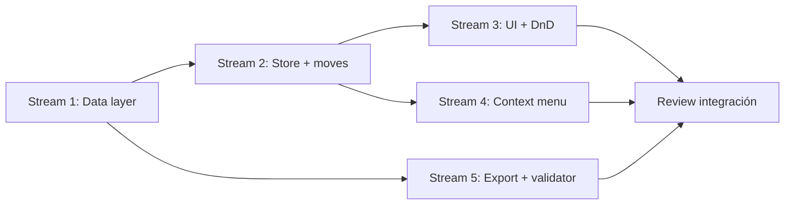

# Plan y especificación: Draft Board (Fase 1)

## Objetivo

Agregar una sección **Draft** global (compartida por todo el equipo, visible en todos los sprints) para agrupar items “en vista” antes de asignarlos a un sprint. Fase 1 incluye **UI completa** + **export en backups**, sin restore automático desde ZIP.

---

## Alcance Fase 1

| Incluido | Excluido (fases futuras) |
|----------|---------------------------|
| Documento Firestore `draftBoard/main` con `items[]` | Restore completo desde ZIP |
| Store Pinia + suscripción realtime | Import JSON al draft desde Header |
| Sección UI colapsable bajo items del sprint | Drag cross-container (draft ↔ sprint board) |
| Reordenar items solo dentro de Draft (DnD) | Mover tasks sueltas sin el item padre |
| Menú contextual: Draft → sprint, sprint → Draft | Storage cleanup considerando draft |
| **Deleted Items** unificada (sprint + Draft) | Restore ZIP |
| Extender `exportAllData` + ZIP + stats + imágenes | Pseudo-sprint `__draft__` |
| Validación ZIP: `draft_board.json` **opcional** | Cambios en reglas Firestore |

---

## Decisiones confirmadas

| # | Tema | Valor |
|---|------|--------|
| 1 | Alcance | Draft **global del equipo** |
| 2 | Label UI | **Draft** |
| 3 | Soft delete | **Opción B** — ver sección [Deleted Items unificada](#deleted-items-unificada-opción-b) |

---

## Decisiones de diseño (resto)

| Tema | Decisión |
|------|----------|
| **Alcance compartido** | Un solo draft **global del equipo** (no por usuario) |
| **Nombre en UI** | **Draft** (subtítulo opcional: “Items en vista”) |
| **Nombre en código / Firestore** | `DraftBoard` (tipo), colección/doc `draftBoard` — **no** reutilizar tipo `Draft` de notas |
| **Ubicación en dashboard** | Debajo de la lista de items del sprint, **antes** de Working Days |
| **Colapsado por defecto** | **Cerrado**; persistir estado en `localStorage` (`draft-section-expanded`) |
| **Crear items** | Botón “New Item” **solo en sprint** (Fase 1); items llegan al draft vía menú o futuro drag |
| **Mover al draft** | Solo **items completos** (con todas sus tasks) |
| **Mover a sprint** | Submenú con **todos** los sprints (mismos colores prev/next que hoy) |
| **Soft delete** | Mismo `deletedAt`; **Deleted Items** incluye eliminados del sprint actual **y** del Draft (opción B) |
| **Gráficos / métricas** | No incluyen items del draft |
| **URL deep link** | Fase 1: sin cambios; `?id=item-*` sigue resolviendo en sprint actual si existe |

---

## Modelo de datos

### Firestore

```
draftBoard (colección)
  └── main (documento único)
        items: Item[]    // mismo shape que sprint.items
        updatedAt?: Timestamp  // opcional, auditoría
```

- **Path recomendado:** `draftBoard/main`
- **Escritura:** `setDoc` completo del documento (mismo patrón que `saveSprint`)
- **Lectura:** `getDoc` + `onSnapshot` para sync en tiempo real

### TypeScript (`src/types/index.ts`)

```ts
export interface DraftBoard {
  id: string;           // siempre "main"
  items: Item[];
  updatedAt?: Date;
}
```

Reutilizar `Item` y `Task` sin cambios de schema.

### Reglas de negocio

1. Un item existe en **exactamente uno** de: un sprint **o** el draft (nunca ambos).
2. Al mover draft → sprint o sprint → draft: recalcular `order` en origen y destino (solo items con `deletedAt === null`).
3. `id` del item **no cambia** al mover (comments, attachments, changes siguen asociados por `associatedId`).
4. Validación anti-pérdida: reutilizar patrón de `validateSprintItemsBeforeSave` adaptado a `draftItemsBackup` en el store del draft (opcional pero recomendado).

---

## Capa de datos (`src/services/firestore.ts`)

### Funciones nuevas

| Función | Descripción |
|---------|-------------|
| `getDraftBoard()` | Lee `draftBoard/main`, normaliza fechas (`convertFirestoreTimestamp`) |
| `saveDraftBoard(board)` | `setDoc` con items serializados |
| `subscribeToDraftBoard(callback)` | `onSnapshot` → callback con `DraftBoard` |

### Cambios en export

| Función | Cambio |
|---------|--------|
| `exportAllData()` | Incluir `draftBoard: DraftBoard \| null` en el return |

---

## Store Pinia (`src/stores/draftBoard.ts`)

Store dedicado (no mezclar con `useSprintStore` para evitar acoplamiento).

### State

- `draftBoard: DraftBoard | null`
- `draftItemsBackup: Item[]` (anti-pérdida)
- `isLoading: boolean`

### Getters

- `draftItems`: items activos (`deletedAt === null`), ordenados por `order`

### Actions

| Action | Comportamiento |
|--------|----------------|
| `initDraftBoardAsync()` | Subscribe + primera carga |
| `saveDraftBoardAsync()` | Persistir + actualizar backup |
| `moveItemToDraftAsync(itemId)` | Desde `currentSprint`, quitar, guardar sprint, push en draft, guardar draft |
| `moveItemFromDraftToSprintAsync(itemId, targetSprintId)` | Inverso de `moveItemToSprint` |
| `reorderDraftItemAsync(itemId, newIndex)` | Reordenar solo en draft |
| `updateItemInDraftAsync` / `updateTaskInDraftAsync` | Delegar a item en draft + save (para edición desde `ItemCard`) |
| `softDeleteItemInDraftAsync` / `softDeleteTaskInDraftAsync` | Igual que sprint: `deletedAt = now`, reordenar activos, `saveDraftBoard` |
| `restoreItemInDraftAsync` / `restoreTaskInDraftAsync` | `deletedAt = null`, reordenar, `saveDraftBoard` |
| `deleteItemInDraftAsync` / `deleteTaskInDraftAsync` | Borrado permanente (splice), como `deleteItem` del sprint |

### Coordinación con `useSprintStore`

- `moveItemToSprint` en sprint store: si el item **no** está en sprint actual, no aplica; la variante desde draft vive en `draftBoard` store.
- Opción: extraer helper interno `transferItemBetweenContainers(from, to)` en un util puro para DRY (refactor mínimo en Fase 1).

---

## UI

### Componente `DraftBoardSection.vue`

Patrón visual: `DeletedItemsSection.vue` (header clickeable full-width).

**Header:**

- Chevron + icono (`mdi-inbox` o `mdi-tray`) + título “Draft”
- Badge con cantidad de items activos
- `(empty)` si count === 0
- Ocupa ancho del board

**Contenido (si expandido):**

- Misma fila de columnas que el sprint (`dashboard-columns.scss`) o reutilizar header-row simplificado
- `ItemCard` por cada item con prop `board-source="draft"`

**Props de `ItemCard` (nueva):**

```ts
boardSource?: "sprint" | "draft";  // default "sprint"
```

Comportamiento según `boardSource`:

| Comportamiento | sprint | draft |
|----------------|--------|-------|
| DnD reorder en board principal | sí | no (solo dentro de draft section) |
| Drop de tasks desde otros items | sí | definir Fase 1: **sí** entre items del draft; desde sprint solo vía menú |
| `saveSprint` al editar | sí | `saveDraftBoard` |
| Menú contextual | + “Move to draft” | “Move to sprint” (todos) |

### `DashboardView.vue`

Insertar después del `v-for` de `ItemCard` del sprint y **antes** de `WorkingDaysToggles`:

```vue
<DraftBoardSection />
```

En `onMounted`: `draftBoardStore.initDraftBoardAsync()` junto a `generateSprints`.

### DnD en Draft

- Contenedor `.draft-board` con `@dragover` / `@drop` análogos a `.board` pero operando sobre `draftBoardStore.draftItems`.
- `useDragDropStore`: opcional flag `dragSource: "sprint" | "draft"` para no mezclar highlights entre boards (recomendado).
- **No** permitir soltar item de sprint en zona draft ni viceversa sin menú (Fase 1).

---

## Deleted Items unificada (opción B)

La sección existente `DeletedItemsSection.vue` (al final del dashboard) agrupa **todo** lo soft-deleted, sin importar si el item vivía en el sprint actual o en el Draft.

### Fuentes de datos

| Origen | Items eliminados | Tasks eliminadas en items activos |
|--------|------------------|-----------------------------------|
| Sprint actual | `currentSprint.items` con `deletedAt !== null` | items activos del sprint con tasks borradas |
| Draft global | `draftBoard.items` con `deletedAt !== null` | items activos del draft con tasks borradas |

### UI

- **Badge** `totalDeletedCount`: suma sprint + draft.
- Subgrupo opcional **“Draft”** bajo el título del grupo de items (chip o subtítulo `Draft`) para distinguir origen.
- Mensajes de restore:
  - Sprint: “visible again in the sprint” (actual).
  - Draft: “visible again in **Draft**”.
- **Permanent delete** en items del draft: `draftBoardStore.deleteItemInDraftAsync` (no `sprintStore.deleteItem`).

### `ItemCard` / menú Delete en Draft

- `boardSource === "draft"` → `softDeleteItemInDraftAsync` / `softDeleteTaskInDraftAsync` en lugar de `sprintStore.softDelete*`.

### Export / backup

- Items con `deletedAt` en `draftBoard.items` se exportan en `draft_board.json` (igual que items borrados dentro de un sprint en `sprints.json`).

---

## Menú contextual (`useContextMenuOptions.ts`)

### Items en sprint (`boardSource === "sprint"`)

Agregar opción (después de “Move to sprint” o antes de Delete):

```ts
{
  key: "move-to-draft",
  label: "Move to draft",
  icon: "mdi-inbox-arrow-down",
  action: () => draftBoardStore.moveItemToDraftAsync(item.id),
}
```

### Items en draft

- Reemplazar / no mostrar “Move to sprint” actual que excluye sprint actual.
- Nueva función `createSprintOptionsForDraft(itemId)` → lista **todos** los sprints con mismos estilos prev/next.
- Ocultar “Move to draft”.
- Mantener: Add task, Sort Tasks, Assign, State, Priority, Delete (delete = soft delete en draft).

### Tasks

Sin cambios Fase 1 (no mover task suelta al draft).

---

## Backups y export (Fase 1)

### `exportAllData()`

Retornar también `draftBoard`.

### `exportService.ts`

| Punto | Cambio |
|-------|--------|
| `generateFullBackup` | `base_de_datos/draft_board.json` |
| `exportDatabaseToJson` | incluye `draftBoard` en el JSON raíz |
| `getExportStats` | `draftItemsCount`, `draftTasksCount`; sumar a totales mostrados o líneas separadas |
| `extractAllImageUrls` | Segundo loop sobre `draftBoard.items` |

### `backupValidator.ts`

- `draft_board.json` **no** en `requiredFiles`
- Si existe: parsear y validar array `items`
- Stats opcionales: `draftItemsCount`

### `ExportBackupDialog.vue`

- Agregar filas en lista de stats: “Draft items”, “Draft tasks” (o nota en descripción)

### `extractBackupData()`

- Retornar `draftBoard` si el archivo existe (preparación futura; sin consumidor en Fase 1)

---

## Archivos a tocar (checklist)

### Nuevos

- `src/stores/draftBoard.ts`
- `src/components/DraftBoardSection.vue`
- `docs/PLAN-DRAFT-BOARD.md` (este archivo)

### Modificar

- `src/types/index.ts`
- `src/services/firestore.ts`
- `src/services/exportService.ts`
- `src/utils/backupValidator.ts`
- `src/views/DashboardView.vue`
- `src/components/ItemCard.vue`
- `src/composables/useContextMenuOptions.ts`
- `src/stores/dragDrop.ts` (si hace falta `dragSource`)
- `src/components/ExportBackupDialog.vue`
- `src/components/DeletedItemsSection.vue` (fuentes sprint + draft, restore/delete según origen)
- `src/main.ts` o init del app (si el subscribe no va en Dashboard)
- `changelog.md` (entrada de feature)

### Sin tocar Fase 1

- `Header.vue` import/export sprint JSON
- `StorageCleanupDialog` / `storageCleanup.ts`
- Restore ZIP (no existe)

---

## Criterios de aceptación

1. La sección Draft aparece en todos los sprints, debajo de los items del sprint activo.
2. Colapsar/expandir funciona; el estado persiste al recargar (localStorage).
3. Mover item sprint → draft y draft → sprint actualiza Firestore en ambos lados sin duplicar el item.
4. Reordenar items **solo** dentro de Draft persiste `order`.
5. Editar item/task en Draft guarda en `draftBoard/main`.
6. Menú contextual coherente en ambos contextos.
7. Backup ZIP y export JSON incluyen `draft_board.json` / `draftBoard`.
8. Backups **antiguos** sin `draft_board.json` siguen validando en cleanup.
9. Gráficos del sprint no cambian al agregar items al draft.
10. Borrar item/task en Draft aparece en **Deleted Items**; restore lo devuelve al Draft.
11. Borrar/restaurar en sprint sigue igual; el contador de Deleted Items incluye ambos orígenes.
12. `pnpm typecheck` y `pnpm lint` sin errores nuevos.

---

## Plan de implementación por streams (paralelizable)



| Stream | Entregable | Depende de |
|--------|------------|------------|
| **1 – Data** | Tipos, firestore CRUD, `exportAllData` | — |
| **2 – Store** | `useDraftBoardStore`, move/reorder | Stream 1 |
| **3 – UI** | `DraftBoardSection`, `DashboardView`, DnD draft, props `ItemCard`, `DeletedItemsSection` | Stream 2 |
| **4 – Menú** | Opciones move draft ↔ sprint | Stream 2 |
| **5 – Export** | ZIP, stats, validator opcional | Stream 1 |

**Orden recomendado si es secuencial:** 1 → 2 → (3 + 4 en paralelo) → 5 → review manual.

**Estimación:** 2–4 días dev según familiaridad con el repo.

---

## Riesgos y mitigaciones

| Riesgo | Mitigación |
|--------|------------|
| Colisión nombre `Draft` (notas) | Tipo `DraftBoard`, doc `draftBoard` |
| Pérdida de items al guardar | `draftItemsBackup` + confirmación (copiar sprint store) |
| Race entre dos usuarios moviendo el mismo item | Último write gana; aceptable Fase 1 |
| Item en draft referenciado en URL de sprint | No resolver en draft Fase 1; documentar |
| Cleanup borra adjuntos solo en draft | Postergar; documentado en Out of scope |

---

## Fase 2 (backlog, no implementar ahora)

- Restore ZIP incluyendo `draft_board.json`
- Storage cleanup: incluir referencias del draft
- “New Item” directo en Draft
- Drag sprint ↔ draft
- Import JSON al draft

---

## Estrategia de ejecución con subagentes

1. **Congelar esta spec** (ajustar tabla de decisiones si hace falta).
2. Lanzar **Stream 1 + 5** en paralelo (data + export, poco acoplamiento UI).
3. Cuando Stream 1 termine → **Stream 2**.
4. En paralelo **Stream 3 + 4** sobre la misma rama o worktrees separados.
5. **Review integración** en un solo agente/persona: `DashboardView`, moves end-to-end, backup manual, typecheck, lint, prueba manual en dev.

**Convención de commits sugerida:** `feat(draft-board): ...` por stream o un PR único con commits atómicos.

---

## Estado del spec

**Cerrado para implementación Fase 1** (2026-05-26).
