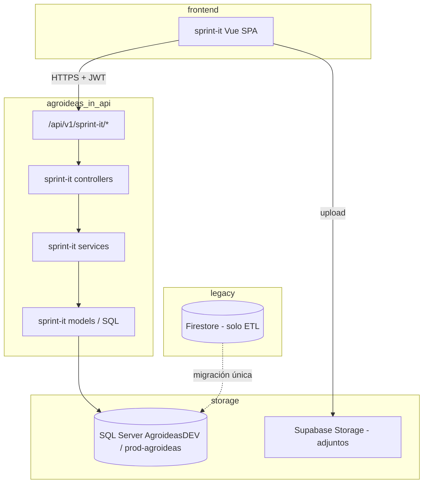

# Plan tentativo: migración Sprint-IT (Firebase → SQL Server)

> **Estado:** borrador / planificación  
> **Última revisión:** 2026-05-22  
> **Backend objetivo:** módulo `sprint-it` dentro de [agroideas-in-api](/home/ljappert/agroideas/agroideas-in-api)  
> **Frontend:** [sprint-it](/home/ljappert/my-repos/sprint-it) (Vue 3 + Vite)

---

## 1. Objetivo

Reemplazar **Firestore** como persistencia de Sprint-IT por **SQL Server**, reutilizando la infraestructura y el stack que ya opera el equipo en `agroideas-in-api` (Express, `mssql`, pools, migraciones SQL con `GO`, JWT).

El frontend dejará de hablar directo con Firebase y consumirá una API REST bajo el prefijo `/api/v1/sprint-it/...`.

### Alcance incluido

| Área | Detalle |
|------|---------|
| Datos | Colecciones actuales: `sprints`, `users`, `comments`, `changes`, `backups`, `attachments`, `notes`, `drafts` |
| Backend | Feature `server/sprint-it/` en agroideas-in-api |
| Auth | Login propio de Sprint-IT (usuarios actuales con `bcrypt`), JWT emitido por la API |
| Migración one-shot | Script ETL Firestore → SQL Server |
| Frontend | Reemplazo de `src/services/firestore.ts` por cliente HTTP |

### Fuera de alcance (fase inicial)

- Migrar **Firebase Storage** (no se usa; adjuntos ya están en **Supabase**).
- Unificar usuarios Sprint-IT con `[In].[Users]` de Agroideas-In (dominios distintos).
- Tiempo real tipo `onSnapshot` (fase posterior opcional).
- Firebase Auth (no se usa hoy).

---

## 2. Arquitectura objetivo



### Principios

1. **Schema dedicado** `[SprintIt]` en la misma base `AgroideasDEV` / `prod-agroideas` (no mezclar tablas con `[In]`).
2. **Capa única en el front:** mantener la interfaz mental de `firestore.ts` vía `sprintItApi.ts` (mismos nombres de funciones donde sea posible).
3. **Credenciales por variables de entorno** en el módulo nuevo (evitar extender passwords hardcodeados de `main.db.ts`).
4. **Migraciones idempotentes** en `migrations_for_SprintIt.sql`, ejecutadas al arranque (patrón `database-checks.models.ts`).

---

## 3. Ubicación en `agroideas-in-api`

Seguir el patrón de features autocontenidas (referencia: `server/agro-news/`).

```
server/sprint-it/
├── sprint-it.routes.ts          # Registro en main.routes
├── sprint-it.controller.ts      # Handlers HTTP
├── sprint-it-auth.controller.ts # login / me / refresh (si aplica)
├── sprint-it.services.ts        # Lógica de negocio
├── sprint-it-auth.services.ts
├── sprint-it.models.ts          # Acceso SQL (queries)
├── sprint-it.types.ts           # DTOs / tipos compartidos con contrato API
└── sprint-it.middleware.ts      # (opcional) auth JWT específico Sprint-IT

server/db/scripts/
├── migrations_for_SprintIt.sql    # CREATE SCHEMA + tablas
└── sprint-it/                     # (opcional) queries sueltas / seeds

server/db/
└── sprint-it.db.ts                # dbSettingsSprintIt (lee env)
```

**Registro de rutas** en `server/routes/main.routes.ts`:

```js
require("../sprint-it/sprint-it.routes")(app);
```

**Prefijo sugerido:** `/api/v1/sprint-it`

> **Nota:** El `checkAuth` actual valida usuarios de `[In].[Users]`. Sprint-IT debe usar **middleware propio** (`checkSprintItAuth`) que valide JWT con claims de `[SprintIt].[Users]`, para no acoplar roles de Agroideas-In.

---

## 4. Base de datos SQL Server

### 4.1 Conexión

Reutilizar el **mismo servidor** que `dbSettingsAgroideasIn`:

| Entorno | Server | Database |
|---------|--------|----------|
| Dev | `agroideas-dev.database.windows.net` | `AgroideasDEV` |
| Prod | `prod-agroideas.database.windows.net` | `prod-agroideas` |
| Local (opcional) | `localhost` / Podman `1433` | Misma DB restaurada o `AgroideasDEV` local |

Nuevo objeto de configuración (ejemplo):

```ts
// server/db/sprint-it.db.ts
export const dbSettingsSprintIt = {
  user: process.env.DB_SPRINTIT_USER,
  password: process.env.DB_SPRINTIT_PASSWORD,
  server: process.env.DB_SPRINTIT_SERVER ?? dbSettingsAgroideasIn.server,
  database: process.env.DB_SPRINTIT_DATABASE ?? dbSettingsAgroideasIn.database,
  options: { encrypt: true, trustServerCertificate: false, enableArithAbort: true },
  schema: "SprintIt",
};
```

Variables sugeridas en `.env` / `.env.production`:

```env
DB_SPRINTIT_SERVER=
DB_SPRINTIT_DATABASE=
DB_SPRINTIT_USER=
DB_SPRINTIT_PASSWORD=
SPRINTIT_JWT_SECRET=
SPRINTIT_JWT_EXPIRES_IN=7d
```

### 4.2 Modelo de datos — enfoque por fases

#### Fase 1 (MVP): híbrido documental + tablas planas

Alineado al uso actual: **un `saveSprint` reescribe el documento completo**.

| Tabla | Propósito |
|-------|-----------|
| `[SprintIt].[Sprints]` | Metadatos del sprint + columna `PayloadJson` (items/tasks anidados) |
| `[SprintIt].[Users]` | Usuarios Sprint-IT (`PasswordHash`, `Username`, etc.) |
| `[SprintIt].[Comments]` | Comentarios (ya colección plana en Firestore) |
| `[SprintIt].[Changes]` | Historial de cambios |
| `[SprintIt].[Attachments]` | Metadata de archivos (URL Supabase) |
| `[SprintIt].[Notes]` | Notas por usuario |
| `[SprintIt].[Drafts]` | Borradores por `UserId` (PK) |
| `[SprintIt].[Backups]` | Última fecha de backup por usuario |

Campos clave `Sprints`:

- `Id` `uniqueidentifier` (conservar IDs Firestore en migración o mapear)
- `Titulo`, `FechaDesde`, `FechaHasta`, `WorkingDaysJson`, `UserWorkingDaysJson`
- `PayloadJson` `nvarchar(max)` — serialización de `items[]` con `tasks[]`
- `RowVersion` `rowversion` — detección de conflictos en updates
- `UpdatedAt`, `UpdatedBy`

**Ventaja:** migración rápida, cambios mínimos en `useSprintStore`.  
**Desventaja:** queries analíticas limitadas; riesgo de overwrite concurrente (mitigar con `RowVersion`).

#### Fase 2 (opcional): normalización

Tablas `Items`, `Tasks` con FK a `Sprints`, updates granulares, mejor reporting.

Solo conviene si el equipo necesita SQL reporting o edición concurrente fuerte.

---

## 5. API REST — mapa desde `firestore.ts`

Contrato orientativo (todos bajo `/api/v1/sprint-it`, salvo auth).

### Auth

| Método | Ruta | Reemplaza |
|--------|------|-----------|
| POST | `/auth/login` | `useAuthStore.login` (Firestore query + bcrypt en cliente) |
| GET | `/auth/me` | sesión / validar token |
| POST | `/auth/logout` | limpieza server-side si hay refresh tokens |

### Sprints

| Método | Ruta | Reemplaza |
|--------|------|-----------|
| GET | `/sprints` | `getAllSprints` |
| GET | `/sprints/:id` | `getSprint` |
| PUT | `/sprints/:id` | `saveSprint` |
| GET | `/sprints/:id/export` | `exportSprintData` / `getFilteredSprintData` |

### Users

| Método | Ruta | Reemplaza |
|--------|------|-----------|
| GET | `/users` | `getAllUsers` |
| GET | `/users/by-username/:username` | `getUserByUsername` |
| POST | `/users/validate-usernames` | `validateUsernames` |
| GET | `/users/:id/username` | `getUsernameById` |
| GET | `/users/:id/display-name` | `getUserDisplayNameAsync` |

### Comments, Changes, Attachments, Notes, Drafts, Backups

Endpoints CRUD espejo de las funciones en `src/services/firestore.ts` (líneas ~196–713).

Ejemplos:

- `GET /comments?associatedId=`
- `POST /changes`
- `GET /changes/recent?days=7`
- `GET /attachments?associatedId=`
- `POST /attachments` + `DELETE /attachments/:id`
- CRUD `/notes`, `/drafts/:userId`, `PUT /backups/:userId`

### Export global

| Método | Ruta | Reemplaza |
|--------|------|-----------|
| GET | `/admin/export-all` | `exportAllData` (proteger: solo admin Sprint-IT) |

---

## 6. Autenticación y seguridad

### Hoy (a corregir en la migración)

- Login en el **browser** con `bcrypt.compare` contra Firestore.
- Reglas Firestore: `allow read, write: if true`.

### Objetivo

| Tema | Decisión tentativa |
|------|-------------------|
| Hash de password | Mantener **bcrypt**; comparación **solo en servidor** |
| Token | **JWT** dedicado (`SPRINTIT_JWT_SECRET`), distinto del JWT de Agroideas-In si aplica |
| Middleware | `checkSprintItAuth` en todas las rutas excepto `login` |
| CORS | Permitir origen del front Sprint-IT (`VITE_API_URL`) |
| Request logs | Opcional: reutilizar `RequestLogs` o tabla `[SprintIt].[RequestLogs]` liviana |

### Usuarios existentes

- ETL copia `users` de Firestore → `[SprintIt].[Users]` conservando `PasswordHash`.
- Script `create-user-template.js` pasa a endpoint `POST /users` (admin) o CLI contra API.

---

## 7. Cambios en el frontend (`sprint-it`)

### 7.1 Nuevos archivos

```
src/services/
├── apiClient.ts           # fetch base, JWT, errores
└── sprintItApi.ts         # reemplazo de firestore.ts (misma API pública)

src/constants/
└── api.ts                 # VITE_SPRINTIT_API_URL
```

### 7.2 Archivos a modificar (~24 consumidores)

- `src/stores/auth.ts` → login vía API (sin `firebase/firestore`)
- `src/stores/sprint.ts` → quitar `subscribeToSprint`; estrategia fase 1 abajo
- Composables y componentes que importan `@/services/firestore`
- Eliminar: `src/services/firebase.ts`, dependencia `firebase` del `package.json` (fase final)

### 7.3 Tiempo real (`onSnapshot`)

| Opción | Esfuerzo | UX |
|--------|----------|-----|
| **A – Polling** al sprint activo cada N segundos | Bajo | Aceptable para pocos usuarios concurrentes |
| **B – WebSocket** vía `WebSocketService` existente en agroideas-in-api | Medio | Similar a Firestore |
| **C – Sin realtime**; refresh manual / tras cada save | Muy bajo | Regresión colaborativa |

**Recomendación fase 1:** opción **A** o **C**; evaluar **B** si hay edición simultánea frecuente.

### 7.4 Variables de entorno (front)

```env
VITE_SPRINTIT_API_URL=http://localhost:2022/api/v1/sprint-it
```

---

## 8. Migración de datos (ETL)

### 8.1 Script one-shot

Ubicación sugerida: `agroideas-in-api/scripts/sprint-it-migrate-from-firestore.js`

1. Leer exportación (`exportAllData` o Admin SDK + `config.json` de sprint-it).
2. Insertar en orden: `Users` → `Sprints` → `Comments` → `Changes` → `Attachments` → `Notes` → `Drafts` → `Backups`.
3. Convertir `Timestamp` Firestore → `datetime2`.
4. Serializar `items`/`tasks` a `PayloadJson` en fase 1.
5. Log de conteos y errores; modo `--dry-run`.

### 8.2 Validación post-migración

- Conteo de documentos vs filas SQL.
- Abrir sprint actual en UI y comparar con Firebase (ventana de lectura dual opcional).
- Verificar login de al menos un usuario por username.

### 8.3 Cutover

1. Mantener Firestore en **solo lectura** (o feature flag `VITE_USE_SQL_BACKEND=true`).
2. Ventana de mantenimiento corta: ETL final incremental + switch de env en front.
3. Backup Firestore exportado archivado.

---

## 9. Adjuntos (Supabase)

Sin cambios de storage. Solo asegurar que `[SprintIt].[Attachments]` guarde la misma metadata (`storageUrl`, `associatedId`, etc.).

El cleanup (`storageCleanup.ts`) seguirá consultando la API en lugar de Firestore.

---

## 10. Fases, entregables y estimación

| Fase | Entregable | Duración orientativa |
|------|------------|---------------------|
| **0 – Diseño** | Este doc + revisión schema + OpenAPI mínimo | 2–3 días |
| **1 – Infra SQL** | `migrations_for_SprintIt.sql`, `RunMigrationsForSprintItAsync`, env vars | 2–3 días |
| **2 – API core** | Auth + CRUD sprints/users (PayloadJson) | 1 semana |
| **3 – API resto** | comments, changes, attachments, notes, drafts, backups, export | 1 semana |
| **4 – Front** | `sprintItApi.ts`, stores, quitar Firebase del bundle | 1 semana |
| **5 – ETL + cutover** | Script migración, pruebas, deploy | 3–5 días |
| **6 – Hardening** | conflictos `RowVersion`, polling/WS, limpieza firebase deps | 1 semana opcional |

**Total tentativo:** 4–6 semanas (1 dev), o 3–4 semanas con MVP sin realtime y sin fase 2 normalizada.

---

## 11. Tareas concretas (checklist)

### agroideas-in-api

- [ ] Crear carpeta `server/sprint-it/`
- [ ] `sprint-it.db.ts` + variables `.env`
- [ ] `migrations_for_SprintIt.sql` (schema + tablas fase 1)
- [ ] Extender `RunMigrationsAsync` → `RunMigrationsForSprintItAsync`
- [ ] Implementar rutas y controllers
- [ ] JWT Sprint-IT + middleware
- [ ] Script ETL Firestore
- [ ] Documentar endpoints en Swagger (opcional)
- [ ] Tests mínimos: login, get/put sprint, comment CRUD

### sprint-it (frontend)

- [ ] `apiClient.ts` + `sprintItApi.ts`
- [ ] Refactor `auth.ts` y `sprint.ts`
- [ ] Actualizar imports en composables/components
- [ ] `VITE_SPRINTIT_API_URL` en `.env.example`
- [ ] Quitar `firebase`, `firebase-admin` del proyecto front
- [ ] Actualizar `AGENTS.md` / README con nuevo flujo
- [ ] Adaptar scripts `migration.js` / `create-user-template.js`

### Operaciones

- [ ] Usuario SQL con permisos solo en schema `[SprintIt]`
- [ ] Deploy API con migraciones en prod
- [ ] Backup Firestore pre-cutover

---

## 12. Riesgos y mitigaciones

| Riesgo | Impacto | Mitigación |
|--------|---------|------------|
| Documento sprint grande (`PayloadJson`) | Timeouts, conflictos | `RowVersion`, límite tamaño, compresión futura |
| Edición concurrente | Pérdida de cambios | Optimistic locking; fase 2 normalizada |
| Mezclar auth Agroideas-In / Sprint-IT | Bugs de permisos | JWT y middleware separados |
| Credenciales en repo | Seguridad | Solo env vars en módulo nuevo |
| Regresión en `useSprintStore` | Alto | Mantener contrato de `sprintItApi`; tests e2e manuales del sprint activo |
| Downtime en cutover | Medio | ETL incremental + flag en front |

---

## 13. Criterios de éxito

1. Login Sprint-IT funciona sin Firestore.
2. CRUD completo de sprint activo (items, tasks, estados, drag) persiste en SQL Server.
3. Comentarios, historial, notas, adjuntos y export operativos.
4. Ninguna dependencia de `firebase` en runtime del front.
5. Datos históricos migrados y verificados.
6. Deploy en dev y prod sobre Azure SQL existente.

---

## 14. Decisiones pendientes (para cerrar antes de Fase 1)

1. ¿Conservar **IDs string de Firestore** en `Sprints.Id` o migrar a `uniqueidentifier` nuevo con tabla de mapeo?
2. ¿Polling interval para sprint activo (ej. 5s / 15s) o sin realtime en MVP?
3. ¿Endpoint de alta de usuarios solo admin o mantener script interno?
4. ¿Registrar requests Sprint-IT en `[In].[RequestLogs]` o tabla propia?
5. ¿Fecha objetivo de cutover y si se requiere lectura dual temporal?

---

## 15. Referencias en el repo

| Recurso | Ubicación |
|---------|-----------|
| Capa Firestore actual | `sprint-it/src/services/firestore.ts` |
| Store principal | `sprint-it/src/stores/sprint.ts` |
| Auth actual | `sprint-it/src/stores/auth.ts` |
| Patrón feature API | `agroideas-in-api/server/agro-news/` |
| Conexión SQL | `agroideas-in-api/server/db/main.db.ts` |
| Migraciones SQL | `agroideas-in-api/server/db/scripts/migrations_for_AgroideasIn.sql` |
| Pool / retry | `agroideas-in-api/server/db/db.helpers.ts` |
| SQL Server local | `agroideas-in-api/docs/sql-server-podman-local.md` |

---

*Documento tentativo: ajustar estimaciones y decisiones pendientes tras una revisión corta con el equipo.*
