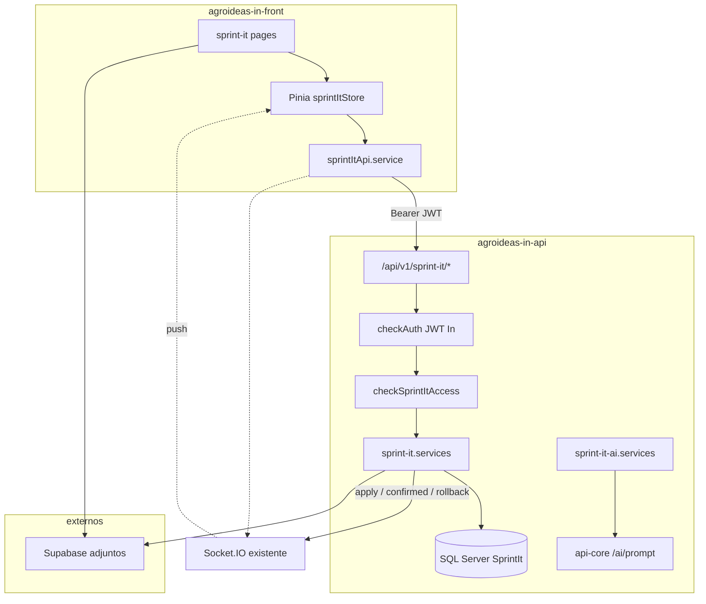
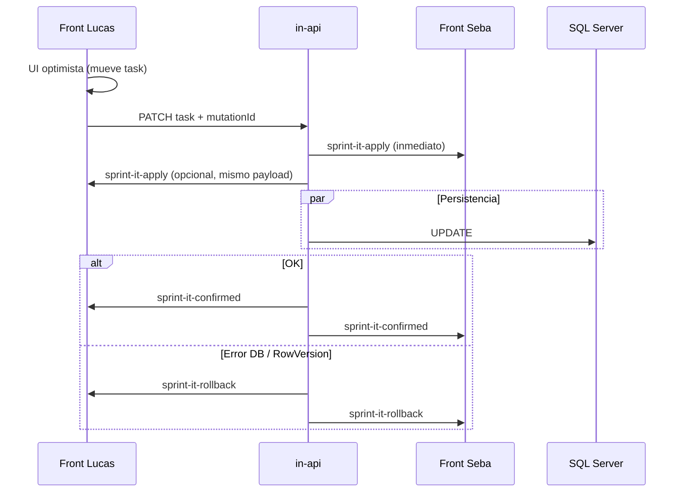

# SPEC E2E: Sprint-IT dentro de Agroideas-In

> **Estado:** listo para ejecución por agentes (pendiente aprobación final)  
> **Última revisión:** 2026-05-28  
> **Agent-readiness:** ~8/10 tras esta revisión (Wave 0 bloqueante)  
> **Repos:** `sprint-it` (origen) · `agroideas-in-api` (backend) · `agroideas-in-front` (UI)  
> **Relacionado:** [PLAN-MIGRACION-SQL-SERVER.md](./PLAN-MIGRACION-SQL-SERVER.md) (borrador previo; este spec lo reemplaza como fuente de verdad)

---

## 0. Resumen ejecutivo

Migrar Sprint-IT de **Firestore + SPA standalone** a:

1. **Datos y lógica** en `agroideas-in-api` → SQL Server schema `[SprintIt]`
2. **Auth** = JWT existente de **Agroideas-In** (`checkAuth`); sin login duplicado
3. **IA (resumen de sprint)** vía **api-core** (`POST /api/v1/ai/prompt`), solo desde servidor (key en env de in-api)
4. **UI** embebida en `agroideas-in-front` (nueva sección/menú); acceso inicial por **allowlist** de `UserName`
5. **Adjuntos** siguen en **Supabase Storage** (sin cambio de bucket)
6. Repo `sprint-it` → legado hasta cutover; luego archivar o mantener solo scripts ETL

---

## 1. Decisiones cerradas

| Tema | Decisión |
|------|----------|
| Backend | `agroideas-in-api`, feature `server/sprint-it/` |
| Base de datos | Azure SQL Server (misma instancia que `[In]`), schema **`[SprintIt]`** |
| Usuarios | **No** tabla `[SprintIt].[Users]`; identidad = `[In].[Users]` + JWT In |
| Acceso al módulo (fase 1) | Allowlist hardcode: `ljappert`, `srotschy` (`UserName` del token) |
| Admins resumen IA | Misma allowlist (fase 1); luego `RoleID` o flag en DB |
| Auth en rutas sprint-it | `checkAuth([])` + middleware `checkSprintItAccess` |
| Modelo de datos sprint (fase 1) | **Normalizado:** `Sprints` + `Items` + `Tasks` (sin blob `PayloadJson`) |
| Realtime | **Socket.IO** + eventos `sprint-it-apply` / `confirmed` / `rollback` (ver §4.2) |
| IA | Prompt **compacto** (&lt;10k chars); sin `model` → cascada api-core |
| Persistencia resumen | Columnas en `[SprintIt].[Sprints]` |
| Front | `agroideas-in-front/src/pages/sprint-it/` (+ stores/services) |
| Repo sprint-it standalone | Deprecar tras cutover; **privar** en GitHub |
| Firebase en runtime | Eliminar del front In |
| **D1 — IDs de sprint** | Conservar **string** de Firestore como PK (`nvarchar`) |
| **D2 — Usuarios en datos** | Columnas `AssignedUserId`, `CreatedByUserId`, etc. → **`In.Users.ID`** (int); ETL con `[SprintIt].[UserIdMapping]` |
| **D3 — Realtime** | **Optimistic UI + WebSocket inmediato:** mutación → API emite `apply` al instante a todos → persiste en SQL en paralelo → `confirmed` o `rollback` si falla DB |
| **D4 — Conflictos / concurrencia** | **`RowVersion`** por fila en `Items` y `Tasks` (y en `Sprints` para metadatos); updates granulares (no guardar el sprint entero) |
| **D5 — Cutover** | Ruta/menú protegidos por allowlist hasta go-live; ventana corta ETL + deploy; luego apagar SPA vieja |
| **D6 — Ruta front** | **`/sprint-it`** (`pages/sprint-it/index.vue`) |
| **D7 — Comentarios realtime** | Tras `POST` OK → WS **`sprint-it-invalidate`** (`scope: comments`) → peer hace **refetch** `GET /comments` (sin `apply`/`rollback` en MVP) |
| **D8 — Conflicto RowVersion** | **`UPDATE … WHERE RowVersion = @rv`** atómico; `@@ROWCOUNT = 0` → **409** + `rollback` solo al originador (sin `apply` al peer) |
| **D9 — Supabase adjuntos** | **Upload directo** desde browser en MVP + **RLS** estricta en bucket; metadata en SQL vía API; proxy in-api en backlog (P6) |
| **D10 — `mutationId` idempotencia** | Cache servidor TTL **60s**; mismo `mutationId` dentro del TTL → misma respuesta sin doble `apply`; **fuera del TTL** → tratar como mutación nueva (el cliente debe generar nuevo `mutationId`) |

### 1.1 Alcance MVP vs Post-MVP

**Incluido en MVP (core):**

- Tablero sprint: sprints, items, tasks, drag, estados, working days
- **Draft board** compartido (`DraftBoardItems`)
- Comentarios + historial de cambios (lectura; escritura de `Changes` solo `state` vía `autoUpdateParentItem` en servidor)
- Adjuntos (upload Supabase + metadata SQL)
- Resumen IA por sprint
- Realtime items/tasks (`apply` / `confirmed` / `rollback`) + comentarios (`sprint-it-invalidate` + refetch)
- Gráficos de progreso y esfuerzo por proyecto

**Fuera de MVP (confirmado por equipo + review técnica):**

| Feature | Origen sprint-it | Post-MVP |
|---------|------------------|----------|
| **Notas** por usuario | `useNotes`, colección `notes` | P7 |
| **Backups** (fecha último backup) | menú usuario, `backups` | P8 |
| **Limpiar storage antiguo** | `storageCleanup` | P9 |
| **Exportar / Importar** (JSON, ZIP, import items) | `Header`, `ExportBackupDialog`, `itemImport` | P10 |
| **Drafts** texto personal por usuario | colección `drafts` (≠ draft board) | P11 |
| Export global `export-all` / admin | `exportService` | P10 |
| Historial versiones `AiSummary` | — | P4 |
| Proxy upload adjuntos vía in-api | — | P6 |

> `GET /sprints/:id/export` **sí** en backend (alimenta resumen IA); **no** botón de export en UI MVP.

**Estimación ejecución (agentes en paralelo):** ~**3–4 días** tras Wave 0 mergeado (ver §9). No usar estimación 6–8 semanas humano.

---

## 2. Arquitectura



### 2.1 Principios

- El browser **nunca** habla con Firestore ni con api-core para IA.
- Token: mismo header `Authorization` que el resto de In (`VITE_USER_DATA_KEY` / axios interceptors existentes).
- Telemetría hacia core: `X-Agroideas-Project-Name: agroideas-in-api`, `X-Agroideas-User-Name: <UserName>`.
- Respuesta HTTP y WebSocket son **canales redundantes**: si el WS falla, el `PATCH` debe devolver el mismo resultado (`confirmed` / `rollback`) en el body.

---

## 3. Base de datos — schema `[SprintIt]`

### 3.1 Tablas (fase 1 — normalizado)

| Tabla | Propósito |
|-------|-----------|
| `[SprintIt].[Sprints]` | Metadatos del sprint + working days + resumen IA |
| `[SprintIt].[Items]` | Items del sprint (FK `SprintId`) |
| `[SprintIt].[Tasks]` | Tasks del item (FK `ItemId`) |
| `[SprintIt].[Comments]` | Comentarios items/tasks |
| `[SprintIt].[Changes]` | Historial (append-only; MVP: solo `state` automático) |
| `[SprintIt].[Attachments]` | Metadata (URL Supabase) |
| `[SprintIt].[DraftBoardItems]` | Tablero borrador compartido (`BoardKey = 'main'`) |
| `[SprintIt].[UserIdMapping]` | ETL: `FirestoreUserId` → `InUserId` (solo migración) |

_Post-MVP:_ `Notes`, `Drafts`, `Backups` (ver §1.1).

### 3.2 Entidades principales

**`[SprintIt].[Sprints]`** — metadatos + IA (sin items embebidos)

| Columna | Tipo | Notas |
|---------|------|-------|
| `Id` | `nvarchar(128)` PK | ID Firestore original |
| `Titulo` | `nvarchar(256)` | |
| `FechaDesde`, `FechaHasta` | `datetime2` | |
| `WorkingDaysJson` | `nvarchar(max)` | 10 bool (puede normalizarse después) |
| `UserWorkingDaysJson` | `nvarchar(max)` | por `In.Users.ID` |
| `AiSummary` … | | igual que antes |
| `RowVersion` | `rowversion` | solo metadatos del sprint |
| `UpdatedAt`, `UpdatedBy` | | |

**`[SprintIt].[Items]`** — espejo de `Item` en `sprint-it/src/types`

| Columna | Tipo | Notas |
|---------|------|-------|
| `Id` | `nvarchar(128)` PK | |
| `SprintId` | `nvarchar(128)` FK | |
| `Title`, `Detail` | `nvarchar` | |
| `Priority`, `State` | `tinyint` o `nvarchar` | alinear enums actuales |
| `EstimatedEffort`, `ActualEffort` | `decimal` | |
| `AssignedUserId` | `int` NULL | → `[In].[Users]` |
| `CreatedByUserId` | `int` | |
| `Order` | `int` | |
| `ProjectName` | `nvarchar` NULL | |
| `DeletedAt` | `datetime2` NULL | soft delete |
| `RowVersion` | `rowversion` | |

**`[SprintIt].[Tasks]`** — espejo de `Task` en `sprint-it/src/types`, FK `ItemId`

| Columna | Tipo | Notas |
|---------|------|-------|
| `Id` | `nvarchar(128)` PK | |
| `ItemId` | `nvarchar(128)` FK | → `Items` |
| `Title` | `nvarchar(512)` | |
| `Detail` | `nvarchar(max)` | |
| `Priority` | `nvarchar(32)` | `'Normal'`, `'Medium'`, `'High'` |
| `State` | `nvarchar(64)` | `'To Do'`, `'In Progress'`, `'Ready For Test'`, `'Done'`, `'Waiting'` |
| `EstimatedEffort` | `decimal(6,2)` | |
| `ActualEffort` | `decimal(6,2)` | |
| `AssignedUserId` | `int` NULL | → `[In].[Users]` |
| `CreatedByUserId` | `int` | |
| `Order` | `int` | |
| `ProjectName` | `nvarchar(128)` NULL | |
| `DeletedAt` | `datetime2` NULL | |
| `CreatedAt` | `datetime2` | |
| `UpdatedAt` | `datetime2` | |
| `UpdatedBy` | `int` NULL | |
| `RowVersion` | `rowversion` | |

**`[SprintIt].[Comments]`**

| Columna | Tipo | Notas |
|---------|------|-------|
| `Id` | `nvarchar(128)` PK | UUID v4 |
| `AssociatedId` | `nvarchar(128)` | item o task |
| `AssociatedType` | `nvarchar(16)` | `'item'` \| `'task'` |
| `UserId` | `int` | → `[In].[Users]` |
| `Description` | `nvarchar(max)` | |
| `CreatedAt`, `UpdatedAt` | `datetime2` | |
| `DeletedAt` | `datetime2` NULL | |

**`[SprintIt].[Changes]`** — append-only (sin UPDATE/DELETE)

| Columna | Tipo | Notas |
|---------|------|-------|
| `Id` | `nvarchar(128)` PK | |
| `AssociatedId`, `AssociatedType` | | |
| `Field` | `nvarchar(64)` | ej. `'state'` |
| `OldValue`, `NewValue` | `nvarchar(max)` NULL | serializados como string |
| `UserId` | `int` | |
| `CreatedAt` | `datetime2` | |

**`[SprintIt].[Attachments]`**

| Columna | Tipo | Notas |
|---------|------|-------|
| `Id` | `nvarchar(128)` PK | |
| `AssociatedId`, `AssociatedType` | | |
| `FileName` | `nvarchar(512)` | |
| `FileType` | `nvarchar(128)` | MIME |
| `FileSize` | `bigint` | |
| `StorageUrl` | `nvarchar(2048)` | Supabase |
| `UploadedByUserId` | `int` | |
| `UploadedAt` | `datetime2` | |
| `DeletedAt` | `datetime2` NULL | |

**`[SprintIt].[DraftBoardItems]`** — columnas como `Items` + `BoardKey nvarchar(32) DEFAULT 'main'` (sin `SprintId`).

### 3.2c `WorkingDaysJson` — formato

`WorkingDaysJson`: array JSON de **10 booleanos** (`true` = hábil).

```json
[true, true, true, true, true, false, false, true, true, true]
```

`UserWorkingDaysJson`: objeto keyed por `In.Users.ID` (string):

```json
{ "42": [true, true, false, true, true, false, false, true, true, true] }
```

ETL: si Firestore tiene `diasHabiles` (int) → `Array.from({ length: 10 }, (_, i) => i < diasHabiles)`.

**Índices mínimos (rendimiento):**

- `Items(SprintId)` include `DeletedAt`, `Order`
- `Tasks(ItemId)` include `DeletedAt`, `Order`
- `Comments(AssociatedId, AssociatedType)`

### 3.3 Migraciones

- Archivo: `agroideas-in-api/server/db/scripts/migrations_for_SprintIt.sql`
- Registro en arranque: `RunMigrationsForSprintItAsync` (patrón `migrations_for_AgroideasIn.sql`)
- Permisos SQL: usuario de app con acceso solo a schema `[SprintIt]` (ideal)

---

## 4. API — `agroideas-in-api`

**Prefijo:** `/api/v1/sprint-it`  
**Registro:** `server/routes/main.routes.ts` → `require("../sprint-it/sprint-it.routes")`

### 4.1 Middleware

```ts
// sprint-it.middleware.ts
// 1) checkAuth([]) — JWT In válido
// 2) checkSprintItAccess — req.user.UserName in SPRINT_IT_ALLOWED_USERNAMES
```

Env sugerida:

```env
SPRINT_IT_ALLOWED_USERNAMES=ljappert,srotschy
AGROIDEAS_CORE_API_URL=...
AGROIDEAS_CORE_API_KEY=...
```

### 4.2 Endpoints

Todas las rutas: `checkAuth([])` + `checkSprintItAccess`.

#### Sprints

| Método | Ruta | Descripción |
|--------|------|-------------|
| GET | `/sprints` | Lista sprints (metadatos) |
| GET | `/sprints/:id` | Sprint + items + tasks (join) |
| PATCH | `/sprints/:id` | Metadatos / working days (`RowVersion` sprint) |
| GET | `/sprints/:id/export` | JSON export (filtro Done, como `exportSprintData`) |
| POST | `/sprints/:id/ai-summary` | Generar resumen IA, persistir, devolver texto |
| GET | `/sprints/:id/ai-summary` | Leer resumen cacheado |

#### Items / Tasks (granular)

| Método | Ruta | Descripción |
|--------|------|-------------|
| POST | `/sprints/:sprintId/items` | Crear item |
| PATCH | `/items/:id` | Actualizar item; ver flujo D3 abajo |
| DELETE | `/items/:id` | Soft delete |
| POST | `/items/:itemId/tasks` | Crear task |
| PATCH | `/tasks/:id` | Actualizar task (mover, estado, esfuerzo, etc.) |
| DELETE | `/tasks/:id` | Soft delete |
| PUT | `/sprints/:id/items/reorder` | Reordenar items (batch opcional) |

**Body común en mutaciones** (items/tasks/reorder):

```json
{
  "mutationId": "uuid-v4",
  "rowVersion": "base64-rowversion",
  "patch": { }
}
```

#### WebSocket (Socket.IO) — flujo D3

Secuencia en el **servidor** tras `POST/PATCH/DELETE` sprint-it:



| Evento | Cuándo | Payload clave |
|--------|--------|-----------------|
| `sprint-it-apply` | Tras validar request; **antes** del `await` SQL | `mutationId`, `sprintId`, `entityType`, `action`, **`entity` calculado en servidor**, `updatedBy` |
| `sprint-it-confirmed` | DB OK | `mutationId`, `rowVersion` actualizado |
| `sprint-it-rollback` | DB falló o conflicto `RowVersion` | `mutationId`, `reason`, `previousEntity` (leído de DB pre-update) |

- **Seba** aplica `apply` en el store al recibir WS (sin esperar GET).
- **Lucas** ya tiene UI optimista; puede ignorar su propio `apply` si `updatedBy === yo`.
- **`rollback`**: ambos revierten el cambio de ese `mutationId` (estado previo en payload o snapshot guardado en store).
- **`confirmed`**: actualizar `rowVersion` local para la siguiente edición.
- **Idempotencia:** cache en servidor `mutationId` → resultado (TTL ~60s) para reintentos de red sin doble `apply`.
- **Reorder:** un solo `mutationId` + transacción SQL para todos los `Order` del sprint.

**Validación antes de `apply` (obligatoria):**

1. `checkAuth` + `checkSprintItAccess` (ya en middleware).
2. Entidad existe y pertenece al `sprintId` activo.
3. `patch` permitido (whitelist de campos: `state`, `order`, `assignedUserId`, etc.).
4. Construir **`entity` en servidor** aplicando `patch` al estado actual (leído de DB en la misma request, antes del UPDATE) — **no reenviar el body del cliente a otros usuarios**.
5. **RowVersion (D8):** leer fila para armar `entity`; el **UPDATE atómico** valida versión (ver §4.2c). Si `@@ROWCOUNT = 0` → **409** sin emitir `apply` al peer.

Reutilizar `agroideas-in-front/src/services/websocket.services.js`.  
Extender `WebSocketService`: `notifySprintItApply`, `notifySprintItConfirmed`, `notifySprintItRollback` → solo `SPRINT_IT_ALLOWED_USERNAMES`.

> **Importante:** `apply` es síncrono antes del `await` SQL. Si falla DB → `rollback` por WS **y** status HTTP 4xx/5xx con el mismo payload. Si el proceso cae entre `apply` y DB → reconciliación al reconectar (§5.4b).

#### 4.2c Patrón atómico `RowVersion` (obligatorio)

No usar SELECT + UPDATE separados (TOCTOU). Ejemplo Items:

```sql
UPDATE [SprintIt].[Items]
SET    State = @state, UpdatedAt = SYSDATETIME(), UpdatedBy = @userId
WHERE  Id = @id AND RowVersion = @rowVersionParam;

IF @@ROWCOUNT = 0 THROW 50409, 'RowVersion mismatch or entity not found', 1;

SELECT RowVersion FROM [SprintIt].[Items] WHERE Id = @id;
```

- Serialización JSON: `RowVersion` ↔ **base64**.
- **`POST` items/tasks:** respuesta incluye `rowVersion` inicial para el primer `PATCH`.
- Tras OK: `sprint-it-confirmed` + HTTP 200 con `{ mutationId, rowVersion }`.

**Realtime en comentarios (D7):**

| Evento | Cuándo | Acción en peer |
|--------|--------|----------------|
| `sprint-it-invalidate` | `POST/PUT/DELETE` comment OK | Si `scope === "comments"` y mismo `associatedId` → `GET /comments?…` |

- Items/tasks: flujo D3 completo (`apply` / `confirmed` / `rollback`).
- Changes/historial: refetch bajo demanda o en invalidación similar (MVP: refetch al abrir panel historial).

#### Comments

| Método | Ruta |
|--------|------|
| GET | `/comments?associatedId=&associatedType=` |
| POST | `/comments` |
| PUT | `/comments/:id` |
| DELETE | `/comments/:id` |

#### Changes

| Método | Ruta |
|--------|------|
| GET | `/changes?associatedId=` |
| POST | `/changes` |
| GET | `/changes/recent?days=7` |

#### Attachments

| Método | Ruta |
|--------|------|
| GET | `/attachments?associatedId=` |
| POST | `/attachments` |
| DELETE | `/attachments/:id` |

#### Draft board (MVP)

| Método | Ruta |
|--------|------|
| GET | `/draft-board` |
| PUT | `/draft-board` |
| POST/PATCH/DELETE | `/draft-board/items` … (CRUD espejo de items, sin sprint) |

#### Utilidades (MVP)

| Método | Ruta | Notas |
|--------|------|-------|
| GET | `/users/display-names` | `id → displayName` desde `[In].[Users]` |
| GET | `/sprints/:id/export` | Solo servidor / IA; **sin UI export** en MVP |

**No hay** `/auth/login` en sprint-it (usa login In existente).

### 4.3 Resumen IA — `sprint-it-ai.services.ts`

1. Cargar sprint + comentarios filtrados (misma lógica que `exportSprintData` en `sprint-it/src/services/firestore.ts`).
2. Armar `compactPrompt` (instrucciones + `projectEffortSummary` + bullets por proyecto; **sin** JSON crudo completo).
3. Validar longitud ≤ **9500** caracteres (margen bajo límite 10k de api-core).
4. `POST {CORE}/api/v1/ai/prompt` con `buildAgroideasCoreHeaders` (referencia: `salary-receipt-ai-digest.services.ts`).
5. Guardar `AiSummary*` en SQL; retornar `{ summary, modelUsed, generatedAt }`.

Errores: 400 sin tasks Done; 502 si core falla; 403 si no allowlist.

**IA — tiempo de respuesta:** endpoint síncrono con timeout generoso (60–90s) o job async + polling; para MVP síncrono está bien (solo admins, uso esporádico).

### 4.3b `autoUpdateParentItem` (servidor — obligatorio)

Ejecutar en la **misma transacción SQL** que el UPDATE/DELETE de la task. Solo tasks activas (`DeletedAt IS NULL`). Si no quedan tasks activas: no modificar el item.

**`State` del item (prioridad):**

| # | Condición | Estado |
|---|-----------|--------|
| 1 | Alguna task `'In Progress'` | `'In Progress'` |
| 2 | Alguna `'Ready For Test'` (ninguna In Progress) | `'Ready For Test'` |
| 3 | Todas `'Done'` | `'Done'` |
| 4 | Alguna `'To Do'` | `'To Do'` |
| 5 | Resto | `'Waiting'` |

**`AssignedUserId`:** (1) primera task In Progress con usuario; (2) si no, usuario con más tasks activas (empate → mantener actual); (3) si ninguna asignada → mantener actual.

**Esfuerzos:** `EstimatedEffort` / `ActualEffort` = SUM de tasks activas.

**`Changes`:** si cambia `state` del item → INSERT en `[Changes]` con `field = 'state'`.

**Front:** el store **NO** ejecuta `autoUpdateParentItem`. Tras `confirmed`, actualizar item padre desde payload del servidor. DoD: `grep -r autoUpdateParentItem src/stores/sprint-it/` → 0 resultados.

### 4.4 Estructura de archivos (in-api)

```
server/sprint-it/
├── sprint-it.routes.ts
├── sprint-it.controller.ts
├── sprint-it.services.ts
├── sprint-it.models.ts
├── sprint-it.types.ts
├── sprint-it.middleware.ts
├── sprint-it-ai.services.ts
├── sprint-it-prompt.builder.ts
├── sprint-it-websocket.ts      # apply / confirmed / rollback
├── sprint-it-mutations.ts      # idempotency + build entity server-side
└── sprint-it.md

server/db/scripts/
└── migrations_for_SprintIt.sql

scripts/
└── sprint-it-migrate-from-firestore.js
```

---

## 5. Frontend — `agroideas-in-front`

### 5.1 Rutas y navegación

| Item | Valor |
|------|-------|
| Ruta | `/sprint-it` → `pages/sprint-it/index.vue` |
| Layout | Default con vertical nav (como resto de In) |
| Menú | Entrada en `src/navigation/vertical/` — visible solo si `canAccessSprintIt(userData)` |
| Guard | `routesAccesibility` **o** guard dedicado en `router/index.js` por `to.path.startsWith('/sprint-it')` |

```ts
// constants/sprint-it.ts
export const SPRINT_IT_ALLOWED_USERNAMES = ["ljappert", "srotschy"] as const;

export const canAccessSprintIt = (userData: { UserName?: string } | null): boolean =>
  !!userData?.UserName &&
  SPRINT_IT_ALLOWED_USERNAMES.includes(userData.UserName as typeof SPRINT_IT_ALLOWED_USERNAMES[number]);
```

### 5.2 Capa de servicios

```
src/services/sprint-it/
├── sprint-it-api.service.ts    # axios → /api/v1/sprint-it (Bearer desde userData.token)
└── sprint-it.types.ts          # ports desde sprint-it/src/types

src/stores/sprint-it/
├── sprint.ts                   # port de useSprintStore
└── draft-board.ts
```

Reutilizar interceptors/auth de In (mismo patrón que otras features).

### 5.3 Componentes a portar (desde `sprint-it`)

Prioridad por dependencia:

| Grupo | Archivos origen (referencia) |
|-------|------------------------------|
| Vista principal | `views/DashboardView.vue`, `components/Header.vue` |
| Tablero | `ItemCard`, `TaskCard`, `DraftBoardSection`, `WorkingDaysToggles` |
| Diálogos | `ItemDialog`, `TaskDialog`, `ContextMenu` vía `useContextMenuOptions` |
| Charts | `UserProgressChart`, `ProjectEffortChart` |
| Colaboración | `CommentSection`, `HistoryView`, `useChangeHistory` |
| Adjuntos | `useAttachments` + Supabase |
| Resumen IA | `SprintSummarySection.vue` |

**Fuera del port MVP:** `ExportBackupDialog`, `storageCleanup`, `useNotes`, import items (§1.1).

**Adaptaciones obligatorias al portar:**

- Quitar `useAuthStore` de sprint-it → `getUserData()` de In.
- Quitar imports `firebase` / `firestore`.
- `assignedUser` / IDs: usar `In.Users.ID` (number).
- Estilos: alinear a Vuetify/variables de In (puede diferir versión; probar en dev).
- TipTap / charts: agregar deps a `agroideas-in-front/package.json` si faltan.

### 5.4 Realtime — optimistic + WebSocket (reemplazo `onSnapshot`)

**Store** (`useSprintItStore`):

1. **Antes del HTTP:** aplicar cambio en memoria + guardar snapshot `{ mutationId, previousEntity }` en cola de pendientes.
2. **Enviar** `PATCH` con `mutationId` + `rowVersion`.
3. **Listeners WS:**
   - `sprint-it-apply`: si `sprintId` activo y `updatedBy !== yo` → aplicar `entity` en store.
   - `sprint-it-confirmed`: quitar de pendientes; actualizar `rowVersion` de la entidad.
   - `sprint-it-rollback`: revertir por `mutationId` (propio o ajeno); toast con `reason`.
4. **Timeout opcional:** si no hay `confirmed` en N s → GET puntual o rollback + reintento.

Al salir de `/sprint-it`: remover listeners (no desconectar WS global de In).

**UX:** movimiento de task percibido instantáneo para ambos; error de DB revierte en los dos clientes sin dejar estados divergentes.

### 5.4b Reconciliación al reconectar WebSocket

En `connect` del socket (inicial y reconexión):

1. Marcar mutaciones pendientes como `in-doubt`.
2. `GET /sprints/:id` del sprint activo (incluye `rowVersion` base64 por entidad).
3. Reemplazar estado del store; vaciar cola de pendientes.
4. Toast si había cambios in-doubt (usuario debe repetir acción si hace falta).

Al salir de `/sprint-it`: `off()` de listeners `sprint-it-*` (no desconectar WS global de In).

### 5.5 Variables de entorno (front)

```env
# Ya existentes en In
VITE_USER_DATA_KEY=...
# Supabase (si uploads directos desde browser)
VITE_SUPABASE_URL=...
VITE_SUPABASE_ANON_KEY=...
# API In (base para sprint-it)
VITE_API_BASE_URL=...   # o la variable que use axios hoy para in-api
```

No agregar `VITE_CORE_API_KEY` al front.

---

## 6. Migración de datos (ETL)

**Script:** `agroideas-in-api/scripts/sprint-it-migrate-from-firestore.js`

1. Input: export ZIP/JSON (`exportAllData` o Admin SDK + `sprint-it/config.json`).
2. Orden: mapping usuarios → `Sprints` → `Items` → `Tasks` → `Comments` → …
3. Transformar timestamps Firestore → `datetime2`.
4. Desanidar items/tasks del JSON Firestore → filas en `Items` / `Tasks` con IDs In en columnas.
5. Flags: `--dry-run`, `--verbose`.
6. **Usuario sin match en `UserIdMapping`:** insertar con `AssignedUserId = NULL` + **warning** en log; no abortar. Al final: reportar conteo de registros sin match.

**Validación:** `--dry-run` conteos; sprint activo en UI; 0 usuarios críticos sin match sin revisión manual.

---

## 7. Seguridad y repos

| Acción | Cuándo |
|--------|--------|
| Privar repo `sprint-it` en GitHub | Antes o en cutover |
| Rotar / restringir keys Firebase si hubo exposición pública | Post-cutover |
| Firestore → solo lectura o apagado | Post-cutover |
| `SPRINT_IT_ALLOWED_USERNAMES` solo en env servidor | Deploy |
| Restringir API key Firebase en GCP (referrers) | Si queda algún uso temporal |
| Supabase bucket `sprint-it` (D9) | RLS estricta; upload directo browser; API solo persiste metadata tras subida OK |
| Allowlist | Misma lista en **env servidor**; front solo oculta menú (la seguridad real es API + WS filter) |
| No confiar en `patch` del cliente para broadcast | Entidad WS armada en servidor (§4.2) |

### 7b Supabase Storage — RLS (D9)

Bucket **`sprint-it`** privado. Path: `sprint-it/<supabase_auth_uid>/<uuid>.<ext>`.

> **Nota:** `supabase_auth_uid` ≠ `In.Users.ID`. Validar que los usuarios del equipo tengan cuenta en Supabase Auth o planificar P6 (proxy).

Políticas orientativas (SQL Editor Supabase): INSERT/DELETE solo en carpeta propia (`auth.uid()`); SELECT para `authenticated` en el bucket.

Flujo: browser sube → `POST /attachments` con metadata + JWT In.

---

## 8. Riesgos conocidos y mitigaciones

| Riesgo | Impacto | Mitigación en spec |
|--------|---------|-------------------|
| `apply` sin persistencia (crash servidor) | UI divergente de DB | HTTP error + reconciliación `GET` al entrar a sprint; timeout en store (§5.4) |
| Edición simultánea misma fila | Pérdida de cambios | `RowVersion` + `rollback` al perdedor |
| Echo malicioso o buggy en WS | Datos corruptos en peer | `entity` server-side, whitelist `patch` |
| Allowlist front ≠ servidor | Menú oculto pero API expuesta | Middleware en **todas** las rutas; WS filtrado por `UserName` |
| Supabase anon en bundle | Subida/lectura indebida | RLS Supabase; no paths predecibles |
| ETL usuarios sin match In | `assignedUser` null | Bloquear cutover hasta mapear; reporte en script |
| Reorder parcial fallido | Orden inconsistente | Transacción SQL única |
| IA timeout | UX colgada | Spinner + timeout claro; no bloquear tablero |
| Doble submit / retry red | Doble movimiento | `mutationId` idempotente |
| Comentarios sin invalidate | Seba no ve comentario | `sprint-it-invalidate` + refetch (D7) |
| Vuetify `3.0.0-beta.11` en In | Port UI falla / loops | §15 componentes permitidos; evaluar upgrade Vuetify pre-port |
| `autoUpdateParentItem` en front y back | Doble fuente de verdad | Solo servidor (§4.3b) |
| Merge conflicts entre agentes backend | Mismo archivo roto | Branches en cadena: Wave 0 → A → B/D/E (§14) |

---

## 9. Fases y estimación (ejecución por agentes)

| Wave | Entregable | Paralelo | Tiempo realista |
|------|------------|----------|-----------------|
| **0** | `migrations_for_SprintIt.sql` completo | — | 3 h |
| **1** | Backend core + CRUD + ETL | A ‖ B ‖ C | 1 día |
| **2** | WebSocket + IA | D ‖ E | 0,5–1 día |
| **3** | Front infra | F | 0,5 día |
| **4** | UI port + WS store | G ‖ H | 1–2 días |
| **5** | Cutover | Humano | 0,5 día |

**Total:** ~**3–4 días** con agentes. Detalle por agente en **§14**.

> Estimación humana legacy (6–8 sem) **obsoleta** para este plan.

---

## 10. Criterios de éxito

- [ ] Login solo en Agroideas-In; sin pantalla login sprint-it.
- [ ] `ljappert` y `srotschy` ven menú y ruta; otros usuarios In → `not-authorized` (API **y** menú).
- [ ] CRUD sprint activo (items, tasks, drag, estados) persiste en SQL.
- [ ] Cambio de task visible en el otro cliente en **&lt; 500 ms** en LAN (objetivo; medir en QA).
- [ ] Fallo de DB revierte UI en **ambos** clientes.
- [ ] Comentarios visibles para el peer sin recargar página (WS o refetch).
- [ ] Generar resumen IA persiste y se muestra en dashboard.
- [ ] Sin `firebase` en bundle de `agroideas-in-front`.
- [ ] Datos históricos migrados y verificados.

---

## 11. Seguimiento — TODO maestro

> Marcar con `[x]` a medida que se complete. Orden recomendado = orden de la lista.

### Fase 0 — Diseño

- [x] **S0.1** Revisión spec con equipo; decisiones D1–D6 cerradas (§1)
- [ ] **S0.2** Confirmar allowlist inicial (`ljappert`, `srotschy`)
- [ ] **S0.3** Privar repo `sprint-it` en GitHub (ops)

### Fase 1 — Backend SQL + sprints

- [ ] **B1.1** Crear `migrations_for_SprintIt.sql` (schema + tablas §3 + índices + `DraftBoardItems`)
- [ ] **B1.2** `RunMigrationsForSprintItAsync` en arranque API
- [ ] **B1.3** Carpeta `server/sprint-it/` + registro en `main.routes.ts`
- [ ] **B1.4** `sprint-it.middleware.ts` (`checkSprintItAccess` + env)
- [ ] **B1.5** `sprint-it.models.ts` — `Sprints`, `Items`, `Tasks` + `RowVersion`
- [ ] **B1.6** `GET /sprints`, `GET /sprints/:id`, `PATCH /sprints/:id`
- [ ] **B1.7** CRUD granular items/tasks + reorder (transacción)
- [ ] **B1.8** Port `autoUpdateParentItem` en services
- [ ] **B1.9** Test Jest mínimo: `GET /sprints` 401 sin JWT, 200 con JWT allowlist

### Fase 2 — WebSocket + backend resto

- [ ] **B2.0** `sprint-it-mutations.ts` (idempotency + entity server-side + whitelist patch)
- [ ] **B2.0b** WS: `apply` / `confirmed` / `rollback` + HTTP body espejo
- [ ] **B2.1** CRUD `Comments`, `Attachments` + `Changes` GET; `invalidate` WS en comments
- [ ] **B2.2** CRUD `DraftBoard` / `DraftBoardItems`
- [ ] **B2.3** `GET /users/display-names`
- [ ] **B2.4** `GET /sprints/:id/export` (solo backend/IA)
- [ ] ~~B2.5 admin/export-all~~ → Post-MVP P10
- [ ] ~~Notes, Drafts, Backups~~ → Post-MVP P7–P8

### Fase 3 — IA + migración datos

- [ ] **B3.1** `sprint-it-prompt.builder.ts` (compacto, ≤9500 chars)
- [ ] **B3.2** `sprint-it-ai.services.ts` → api-core `/ai/prompt`
- [ ] **B3.3** `POST/GET .../ai-summary`
- [ ] **B3.4** Script `sprint-it-migrate-from-firestore.js` + `--dry-run`
- [ ] **B3.5** Tabla/mapping usuarios Firestore → In (`UserIdMapping`)
- [ ] **B3.6** Ejecutar ETL en dev y validar conteos

### Fase 4 — Front infra

- [ ] **F4.1** `SPRINT_IT_ALLOWED_USERNAMES` + `canAccessSprintIt`
- [ ] **F4.2** Entrada menú vertical (condicional)
- [ ] **F4.3** `pages/sprint-it/index.vue` + guard router
- [ ] **F4.4** `sprint-it-api.service.ts` (axios + JWT)
- [ ] **F4.5** Pinia `useSprintItStore` — load/save granular + WS listener
- [ ] **F4.6** Deps npm (TipTap, chart, supabase, etc.)

### Fase 5 — Front UI port

- [ ] **F5.1** Port `DashboardView` + layout In
- [ ] **F5.2** Port tablero items/tasks + draft board
- [ ] **F5.3** Port diálogos + context menu + composables
- [ ] **F5.4** Port charts (user progress, project effort)
- [ ] **F5.5** Port comments, history, attachments (sin notas — §1.1)
- [ ] **F5.6** `SprintSummarySection` + acciones admin (generar/copiar/regenerar)
- [ ] **F5.7** Store optimistic + handlers `apply` / `confirmed` / `rollback`
- [ ] ~~**F5.8** Export / backup / import~~ → Post-MVP P10
- [ ] **F5.9** QA manual flujo completo sprint

### Fase 6 — Cutover

- [ ] **C6.1** ETL prod + backup Firestore archivado
- [ ] **C6.2** Deploy in-api con env prod (`SPRINT_IT_*`, `AGROIDEAS_CORE_*`)
- [ ] **C6.3** Deploy in-front
- [ ] **C6.4** Deshabilitar Hosting sprint-it standalone (o redirect a In)
- [ ] **C6.5** Actualizar `AGENTS.md` / README en los 3 repos
- [ ] **C6.6** Criterios de éxito §10 verificados en prod

### Post-MVP (backlog)

- [ ] **P1** Allowlist → rol/permiso en `[In]`
- [ ] **P2** Rooms Socket.IO por `sprintId`
- [ ] **P3** Normalizar `WorkingDays` en tablas
- [ ] **P4** Historial versiones `AiSummary`
- [ ] **P5** Reconciliación manual / job nocturno
- [ ] **P6** Proxy upload adjuntos (sin anon key en front)
- [ ] **P7** Notas por usuario
- [ ] **P8** Backups
- [ ] **P9** Limpiar storage antiguo
- [ ] **P10** Export / import / `export-all` en UI
- [ ] **P11** Drafts texto personal por usuario

---

## 12. Referencias de código

| Recurso | Ubicación |
|---------|-----------|
| Firestore actual | `sprint-it/src/services/firestore.ts` |
| Store sprint | `sprint-it/src/stores/sprint.ts` |
| Export + prompt IA | `firestore.ts` → `exportSprintData` |
| Patrón feature API | `agroideas-in-api/server/agro-news/` |
| Cliente api-core | `agroideas-in-api/server/helpers/agroideas-core-client.helper.ts` |
| IA vía core (ejemplo) | `agroideas-in-api/server/services/salary-receipt-ai-digest.services.ts` |
| Auth In | `agroideas-in-api/server/middlewares/auth.middleware.ts` |
| Router + roles front | `agroideas-in-front/src/router/index.js`, `router/utils.js` |
| Menú vertical | `agroideas-in-front/src/navigation/vertical/` |
| WebSocket In | `agroideas-in-front/src/services/websocket.services.js` |
| Vuetify In | `agroideas-in-front/package.json` → `vuetify@3.0.0-beta.11` |

---

## 13. Agent execution playbook (§11 ↔ waves)

> **Regla:** Wave 0 merge a `main` antes de Wave 1+. No dos agentes en el mismo branch de backend a la vez.

### Wave 0 — `schema-agent` (bloqueante)

- **TODO:** B1.1
- **DoD:** archivo termina con `-- MIGRATION SprintIt COMPLETE`; todas las tablas §3.1; índices; `ROWVERSION` en Sprints/Items/Tasks.

### Wave 1 — paralelo tras Wave 0

| Agente | TODOs | Archivos clave |
|--------|-------|----------------|
| **A** models | B1.2–B1.6 | `sprint-it.*`, `main.routes.ts`, migraciones arranque |
| **B** crud | B1.7–B1.8, B2.1–B2.4 | extiende services; §4.3b obligatorio |
| **C** etl | B3.4–B3.6 | `scripts/sprint-it-migrate-from-firestore.js` |

Merge: **A** primero → **B** y **C** desde branch actualizado.

### Wave 2 — paralelo

| Agente | TODOs |
|--------|-------|
| **D** websocket | B2.0, B2.0b |
| **E** ai | B3.1–B3.3 |

### Wave 3 — `front-infra-agent`

- **TODOs:** F4.1–F4.6 (requiere Agente A mergeado)

### Wave 4 — paralelo

| Agente | TODOs | Nota |
|--------|-------|------|
| **G** ui | F5.1–F5.6 | respetar §15 Vuetify |
| **H** ws-store | F5.7 | §5.4 + §5.4b; sin `autoUpdateParentItem` en store |

### Wave 5 — cutover (humano)

- **TODOs:** C6.1–C6.6

---

## 14. Restricciones Vuetify `3.0.0-beta.11`

`agroideas-in-front`: **Vue 3.2.37**, **Vuetify 3.0.0-beta.11** (nov 2022). No usar docs de Vuetify 3 estable al portar.

**Permitidos:** `v-card`, `v-btn`, `v-dialog` (`:model-value`), `v-text-field`, `v-textarea`, `v-select`, `v-chip`, `v-menu`, `v-list`, `v-tooltip`, `v-row`/`v-col`, `v-progress-circular`, `v-alert`.

**Evitar:** `v-data-table`; `density="compact"` (usar `dense` donde aplique); slots modernos no verificados.

**Drag-and-drop:** `vuedraggable@next` (verificar compat Vue 3.2).

**Alternativa:** actualizar Vuetify a 3.x estable en In antes del port (evaluar en §16).

---

## 15. Pendiente de definición (equipo)

| # | Tema | Opciones | Impacto si no se define |
|---|------|----------|-------------------------|
| 1 | **Vuetify** | Port contra beta.11 vs upgrade In primero | Fase UI (Wave 4) |
| 2 | **Supabase Auth** | ¿Usuarios In tienen UID en Supabase para RLS D9? | Adjuntos |
| 3 | **Allowlist prod** | Confirmar `ljappert`, `srotschy` (S0.2) | Deploy |
| 4 | **Aprobación spec** | Go implementación | — |

**Ya cerrado en esta revisión:** Draft board (`DraftBoardItems`), RowVersion atómico, MVP sin notas/backups/export/import/storage cleanup, ETL usuarios sin match → null + warning, comentarios invalidate+refetch.

---

## 16. Changelog del spec

| Fecha | Cambio |
|-------|--------|
| 2026-05-28 | Versión inicial E2E (In auth, in-api, in-front, IA core, TODO maestro) |
| 2026-05-28 | Cerradas D1–D6 en §1; renumeración de secciones |
| 2026-05-28 | D3 → WebSocket; D4 → schema normalizado + updates granulares |
| 2026-05-28 | D3: flujo optimistic + apply/confirmed/rollback |
| 2026-05-28 | Revisión: §8 riesgos, entity server-side, índices, draft board, criterios latencia |
| 2026-05-28 | Cerradas D7–D9; D10 mutationId TTL |
| 2026-05-28 | §1.1 MVP scope; integración review agentes §13–§15 |
| 2026-05-28 | MVP fuera: notas, backups, export/import, storage cleanup |
| 2026-05-28 | Schemas SQL completos; §4.2c RowVersion; §4.3b autoUpdateParentItem |

---

*Aprobación:* pendiente — implementar código solo tras confirmación explícita del equipo.
