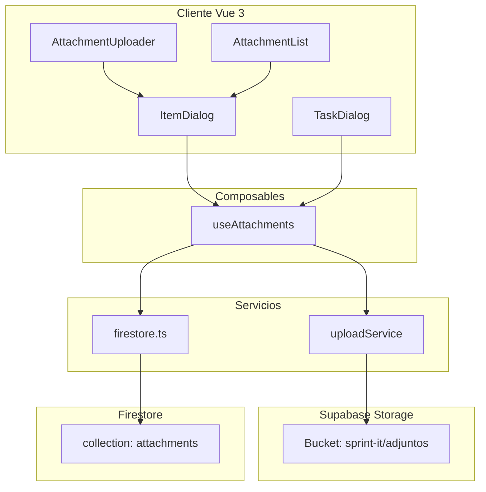
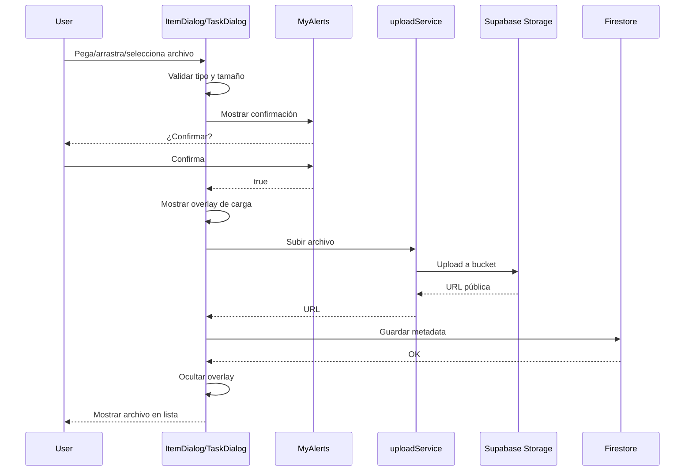

# Plan: Sistema de Adjuntos para Items y Tasks

## Resumen Ejecutivo

Implementar funcionalidad para adjuntar archivos a items/tasks mediante:

- Pegado desde portapapeles (Ctrl+V)
- Arrastrar y soltar (drag & drop)
- Botón selector de archivos

**Almacenamiento**: Supabase Storage (bucket `sprint-it`, carpeta `adjuntos/`)

**Límites**:

- Máximo 5MB por archivo
- Máximo 2 archivos por item/task
- Tipos permitidos: PDF, Excel (.xlsx, .xls), Word (.doc, .docx), imágenes, ZIP, RAR

---

## Arquitectura



---

## Detalle de Implementación

### 1. Tipos TypeScript

**Archivo**: `src/types/index.ts`

Agregar interface `Attachment`:

```typescript
export interface Attachment {
    id: string;
    associatedId: string; // id del item o task
    associatedType: "item" | "task";
    fileName: string;
    fileType: string;
    fileSize: number;
    storageUrl: string;
    uploadedBy: string; // user id
    uploadedAt: Date;
}
```

### 2. Constantes de Configuración

**Archivo**: `src/constants/attachments.ts` (nuevo)

```typescript
export const ATTACHMENT_CONFIG = {
    MAX_FILE_SIZE: 5 * 1024 * 1024, // 5MB en bytes
    MAX_ATTACHMENTS_PER_ITEM: 2,
    ALLOWED_TYPES: [
        "application/pdf",
        "application/vnd.ms-excel",
        "application/vnd.openxmlformats-officedocument.spreadsheetml.sheet",
        "application/msword",
        "application/vnd.openxmlformats-officedocument.wordprocessingml.document",
        "image/png",
        "image/jpeg",
        "image/gif",
        "image/webp",
        "application/zip",
        "application/x-rar-compressed",
    ],
    ALLOWED_EXTENSIONS: [".pdf", ".xlsx", ".xls", ".doc", ".docx", ".png", ".jpg", ".jpeg", ".gif", ".webp", ".zip", ".rar"],
} as const;

// Helper para formatear tamaño de archivo
export const formatFileSize = (bytes: number): string => {
    if (bytes === 0) return "0 Bytes";
    const k = 1024;
    const sizes = ["Bytes", "KB", "MB", "GB"];
    const i = Math.floor(Math.log(bytes) / Math.log(k));
    return parseFloat((bytes / Math.pow(k, i)).toFixed(2)) + " " + sizes[i];
};
```

### 3. Servicio de Uploads

**Archivo**: `src/services/uploads.ts` (nuevo)

- Reutilizar `supabaseUploader` existente
- Modificar para usar carpeta `adjuntos/`
- Agregar función `uploadAttachment(file: File): Promise<string>`

### 4. Funciones Firestore

**Archivo**: `src/services/firestore.ts`

Agregar funciones:

- `addAttachment(attachment: Omit<Attachment, "id">): Promise<string>`
- `getAttachmentsByAssociatedId(associatedId: string): Promise<Attachment[]>`
- `deleteAttachment(attachmentId: string): Promise<void>`

### 5. Composable useAttachments

**Archivo**: `src/composables/useAttachments.ts` (nuevo)

Proporcionar:

- `attachments`: ref<Attachment[]>
- `isUploading`: ref<boolean> - estado de carga
- `loadAttachments(associatedId: string, type: "item" | "task"): Promise<void>`
- `uploadFile(file: File): Promise<Attachment>`
- `handlePaste(event: ClipboardEvent): Promise<void>`
- `handleDrop(event: DragEvent): Promise<void>`
- `removeAttachment(attachmentId: string): Promise<void>`
- `validateFile(file: File): { valid: boolean; error?: string }`

### 6. Modificación de ItemDialog.vue

**Cambios en el template**:

1. Cambiar `v-btn-toggle` por `v-tabs` para mejor UX
2. Agregar pestaña "Attachments" (tercera pestaña)
3. En pestaña "attachments":
    - Zona de drag & drop
    - Botón para seleccionar archivos
    - Lista de archivos adjuntos con opción de eliminar
    - **Indicador de carga mientras sube el archivo**

**Cambios en el script**:

1. Importar y usar `useAttachments`
2. Agregar event listener para `paste` en el modal
3. Agregar event listener para `drop` en la zona de adjuntos
4. Guardar referencias de adjuntos en el item al guardar
5. **Usar MyAlertDialog para confirmar antes de subir**

### 7. Modificación de TaskDialog.vue

Aplicar mismos cambios que ItemDialog.vue (reutilizar lógica del composable).

### 8. Componentes Reutilizables

**AttachmentUploader.vue**:

- Input file oculto
- Botón para abrir selector
- Zona visual de drag & drop
- Validación de archivos
- **Confirmación antes de subir usando MyAlerts** (`warmConfirmAsync`)
- **Indicador de carga durante el upload** (spinner/overlay)
- Mostrar nombre y tamaño del archivo antes de confirmar

**AttachmentList.vue**:

- Mostrar lista de adjuntos con iconos por tipo
- Botón de descargar (abrir en nueva pestaña)
- Botón de eliminar
- Indicador de tamaño formateado

---

## Métodos de Adjuntar Archivos

### 1. Pegar desde Portapapeles (Ctrl+V)

```typescript
const handlePaste = async (event: ClipboardEvent) => {
    const items = event.clipboardData?.items;
    if (!items) return;

    for (const item of items) {
        if (item.kind === "file") {
            const file = item.getAsFile();
            if (file) {
                // Confirmar antes de subir usando MyAlerts
                const confirmed = await warmConfirmAsync(
                    `<p>¿Deseas adjuntar el archivo <strong>${file.name}</strong>?</p>
                     <p>Tamaño: ${formatFileSize(file.size)}</p>`,
                );

                if (confirmed) {
                    await uploadFile(file);
                }
            }
        }
    }
};
```

**Nota**: Detectar si es imagen u otro tipo de archivo del portapapeles.

### 2. Arrastrar y Soltar

```typescript
const handleDrop = async (event: DragEvent) => {
    event.preventDefault();
    const files = event.dataTransfer?.files;
    if (!files) return;

    for (const file of Array.from(files)) {
        // Confirmar antes de subir usando MyAlerts
        const confirmed = await warmConfirmAsync(
            `<p>¿Deseas adjuntar el archivo <strong>${file.name}</strong>?</p>
             <p>Tamaño: ${formatFileSize(file.size)}</p>`,
        );

        if (confirmed) {
            await uploadFile(file);
        }
    }
};
```

### 3. Botón Selector

```typescript
const handleFileSelect = async (event: Event) => {
    const input = event.target as HTMLInputElement;
    const files = input.files;
    if (!files) return;

    for (const file of Array.from(files)) {
        // Confirmar antes de subir usando MyAlerts
        const confirmed = await warmConfirmAsync(
            `<p>¿Deseas adjuntar el archivo <strong>${file.name}</strong>?</p>
             <p>Tamaño: ${formatFileSize(file.size)}</p>`,
        );

        if (confirmed) {
            await uploadFile(file);
        }
    }
    // Limpiar input
    input.value = "";
};
```

### 4. Indicador de Carga

Mostrar un indicador visual mientras el archivo se está subiendo:

- Usar `useLoadingStore` existente o un estado local `isUploading`
- Mostrar un spinner o overlay con texto "Subiendo archivo..."
- Deshabilitar interacciones mientras sube

```typescript
// En el composable o componente
const isUploading = ref(false);

const uploadFile = async (file: File) => {
    isUploading.value = true;
    try {
        // ... lógica de upload
    } finally {
        isUploading.value = false;
    }
};
```

Template:

```html
<v-overlay :model-value="isUploading" class="align-center justify-center">
    <div class="text-center">
        <v-progress-circular indeterminate size="64"></v-progress-circular>
        <p class="mt-4">Subiendo archivo...</p>
    </div>
</v-overlay>
```

---

## Validaciones

### Validación de Tipo

```typescript
const validateFileType = (file: File): boolean => {
    const extension = "." + file.name.split(".").pop()?.toLowerCase();
    return ATTACHMENT_CONFIG.ALLOWED_EXTENSIONS.includes(extension);
};
```

### Validación de Tamaño

```typescript
const validateFileSize = (file: File): boolean => {
    return file.size <= ATTACHMENT_CONFIG.MAX_FILE_SIZE;
};
```

### Validación de Cantidad

```typescript
const validateAttachmentCount = (): boolean => {
    return attachments.value.length < ATTACHMENT_CONFIG.MAX_ATTACHMENTS_PER_ITEM;
};
```

### Mensajes de Error

| Validación         | Mensaje                                                                               |
| ------------------ | ------------------------------------------------------------------------------------- |
| Tipo no permitido  | "Tipo de archivo no permitido. Solo se admiten: PDF, Excel, Word, imágenes, ZIP, RAR" |
| Archivo muy grande | "El archivo supera el límite de 5MB"                                                  |
| Límite alcanzado   | "Solo se pueden adjuntar máximo 2 archivos por item/task"                             |

---

## Flujo de Usuario



---

## Estructura de Archivos a Crear/Modificar

```
src/
├── constants/
│   └── attachments.ts          [NUEVO]
├── services/
│   └── uploads.ts              [NUEVO]
├── composables/
│   └── useAttachments.ts       [NUEVO]
├── components/
│   ├── AttachmentUploader.vue  [NUEVO]
│   ├── AttachmentList.vue      [NUEVO]
│   ├── ItemDialog.vue          [MODIFICAR]
│   └── TaskDialog.vue          [MODIFICAR]
└── types/
    └── index.ts                [MODIFICAR]
```

---

## Consideraciones Adicionales

1. **Reutilización de código**: El composable `useAttachments` será usado tanto en ItemDialog como en TaskDialog.

2. **UX**:
    - ✅ Mostrar spinner mientras sube el archivo (overlay)
    - ✅ Notificaciones de éxito/error
    - ✅ Confirmación antes de subir (MyAlerts)
    - Preview del archivo si es imagen

3. **Seguridad**:
    - Validar tipo y tamaño en cliente Y servidor (Firebase Rules)
    - Verificar que el usuario esté autenticado

4. **Migración de datos**: No requiere migración ya que es funcionalidad nueva.

5. **Impacto en almacenamiento**: Los archivos se almacenan en Supabase Storage, no en Firestore.

---

## Siguientes Pasos

1. Implementar tipos y constantes
2. Crear servicio de uploads
3. Agregar funciones Firestore
4. Crear composable useAttachments
5. Crear componentes de UI
6. Integrar en ItemDialog y TaskDialog
7. Probar las 3 formas de adjuntar archivos
