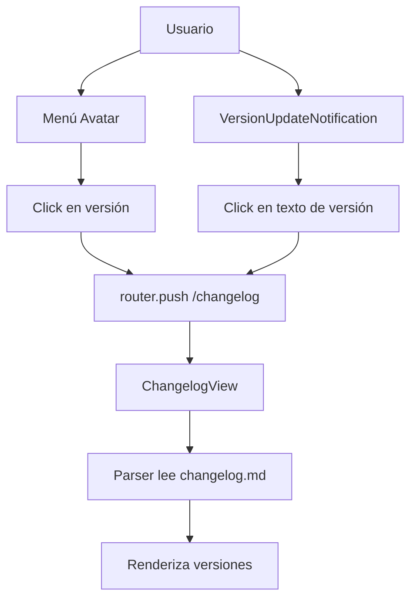

# Plan: Implementación de Sección /Changelog

## Objetivo

Crear una sección `/changelog` accesible desde:

1. El menú del avatar de usuario (donde muestra la versión)
2. El componente `VersionUpdateNotification.vue`

---

## Tareas Detalladas

### 1. Agregar ruta /changelog en el router

**Archivo:** `src/router/index.ts`

- Agregar nueva ruta `/changelog` que cargue el componente `ChangelogView`
- Mantener el `beforeEnter` para verificar autenticación

```typescript
{
    path: "/changelog",
    name: "changelog",
    component: () => import("@/views/ChangelogView.vue"),
    beforeEnter: (to, from, next) => {
        const authStore = useAuthStore();
        if (!authStore.isAuthenticated) {
            next("/");
        } else {
            next();
        }
    },
}
```

### 2. Adaptar el parser del changelog.vue

**Archivo:** `src/views/changelog.vue`

El formato actual del changelog.md es:

```
## v1.1.28 - 2026-03-10

### Nuevas Funciones

- **Título**: Descripción
    - Subtítulo 1
```

El parser debe:

- Buscar `## vX.X.X - YYYY-MM-DD` en lugar de `#### [Versión X.X.X]`
- Extraer la versión del patrón `v1.1.28`
- Extraer la fecha del patrón `- 2026-03-10`
- Procesar los apartados `### Nuevas Funciones`, `### Cambios`, `### Arreglos`

### 3. Actualizar estilos de changelog.vue

**Archivo:** `src/views/changelog.vue`

Adaptar al tema oscuro del dashboard:

- Background: `$bg-primary` (#171717)
- Texto primario: `$primary` (#33c7ff)
- Texto secundario: `$text` (#a8a8a8)
- Usar las clases de Vuetify y SCSS existentes

### 4. Modificar VersionUpdateNotification.vue

**Archivo:** `src/components/VersionUpdateNotification.vue`

Cambios:

- El texto "Estás usando la versión {{ version }}" debe ser un enlace a `/changelog`
- El enlace debe tener el formato: "v{{ version }} - See changelog"
- El botón cerrar debe seguir funcionando (no verse afectado por el enlace)
- Agregar router.push('/changelog') al hacer click en el enlace

### 5. Modificar el menú del avatar en Header.vue

**Archivo:** `src/components/Header.vue`

Cambios en el menú de usuario (líneas 46-48):

- Actualmente: `<div class="menu-item version"><span>v{{ appVersion }}</span></div>`
- Cambiar a: `<div class="menu-item version" @click="goToChangelog"><span>v{{ appVersion }} - See changelog</span></div>`

Agregar función `goToChangelog`:

```typescript
const goToChangelog = () => {
    router.push("/changelog");
};
```

### 6. Verificar funcionamiento

- Navegar a /changelog directamente
- Verificar que el menú del avatar navega al changelog
- Verificar que VersionUpdateNotification navega al changelog
- Verificar que el parser muestra correctamente las versiones

---

## Archivos a modificar

1. `src/router/index.ts` - Agregar ruta
2. `src/views/changelog.vue` - Adaptar parser y estilos
3. `src/components/VersionUpdateNotification.vue` - Agregar enlace
4. `src/components/Header.vue` - Hacer versión clickeable

---

## Diagrama de Flujo


