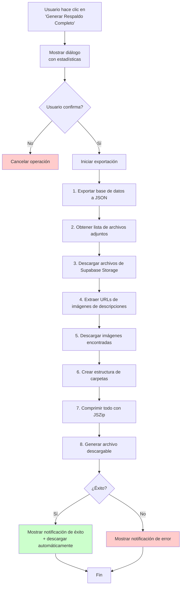

# Plan: Exportación de Base de Datos Completa a RAR

## Objetivo

Agregar opciones en el menú del avatar para exportar datos:

1. **Exportar JSON**: Descarga simple de la base de datos (usando `exportAllData` existente mejorado)
2. **Generar Respaldo Completo (RAR)**: Archivo comprimido con toda la base de datos + archivos físicos

---

## Análisis del Sistema Actual

### Arquitectura de Datos

- **Base de datos**: Firebase Firestore con colecciones:
    - `sprints` - Sprints con items y tasks anidados
    - `users` - Usuarios
    - `comments` - Comentarios
    - `changes` - Historial de cambios
    - `backups` - Registro de backups
    - `attachments` - Metadatos de archivos adjuntos

- **Almacenamiento de archivos**: Supabase Storage
    - Bucket: `sprint-it`
    - Ruta: `detalles/{uuid}_{filename}`

- **Imágenes en descripciones**:
    - ImageLink y ResizableImage (extensiones Tiptap)
    - Se almacenan como URLs en campos `detail` de items/tasks
    - También pueden estar en comentarios

### Funcionalidad Existente

- [`exportAllData()`](src/services/firestore.ts:268) ya exporta sprints, users, comments, changes a JSON
- [`exportSprintData()`](src/services/firestore.ts:466) exporta datos filtrados de un sprint

---

## Plan de Implementación

### Fase 1: Mejora de exportAllData y Servicio de Exportación

**1.1 Mantener [`exportAllData()`](src/services/firestore.ts:268) existente**

- Esta función seguirá descargando un JSON simple (sin cambios visibles para el usuario)
- Agregar internamente: exportar también los attachments (metadatos completos)

**1.2 Crear nuevo servicio: `src/services/exportService.ts`**

- Funciones para obtener estadísticas de la base de datos:
    - Cantidad de sprints
    - Cantidad de items (recorriendo todos los sprints)
    - Cantidad de tasks
    - Cantidad de archivos adjuntos
    - Cantidad de imágenes en descripciones
- Función para calcular tamaño estimado
- Función principal `generateFullBackup()` para generar el RAR completo

### Fase 2: Descarga de Archivos

**2.1 Función para descargar archivos de Supabase Storage**

- Usar el cliente de Supabase para obtener archivos
- Manejar autenticación anónima para archivos públicos

**2.2 Extraer URLs de imágenes de descripciones**

- Buscar en campos `detail` de items y tasks (usar regex para encontrar URLs de imágenes)
- Buscar en comentarios
- Filtrar solo URLs de imágenes válidas (jpg, png, gif, webp, etc.)
- Descargar cada imagen

### Fase 3: Generación de RAR/ZIP

**3.1 Evaluar alternativas**

- **JSZip**: Solo ZIP, no RAR. Pero es más que suficiente.
- **RAR.js**: No existe implementación robusta en JS
- **zip-js**: Alternativa más moderna

**Decisión**: Usar **JSZip** para generar archivos ZIP (extensión .zip). El usuario solicitó ".rar" pero técnicamente un ZIP cumple la misma función de comprimir múltiples archivos. JSZip es más estable y ampliamente usado.

**3.2 Estructura del archivo generado**

```
exportacion_YYYY-MM-DD_HH-mm/
├── base_de_datos/
│   ├── sprints.json
│   ├── users.json
│   ├── comments.json
│   ├── changes.json
│   └── attachments.json
├── adjuntos/
│   ├── {uuid_filename}.{ext}
│   └── ...
└── imagenes/
    ├── items/
    │   ├── {item_id}/
    │   │   └── {imagen}.{ext}
    │   └── ...
    ├── tasks/
    │   ├── {task_id}/
    │   │   └── {imagen}.{ext}
    │   └── ...
    └── comentarios/
        ├── {comment_id}/
        │   └── {imagen}.{ext}
        └── ...
```

### Fase 4: UI de Exportación

**4.1 Modificar [Header.vue](src/components/Header.vue)**

- Agregar submenú "Exportar" en el menú del avatar con dos opciones:
    - **"Exportar JSON"** - usa exportAllData existente
    - **"Generar Respaldo Completo"** - nueva funcionalidad completa
- Iconos diferenciados para cada opción

**4.2 Diálogo de información previa (para RAR)**

Antes de generar el RAR, mostrar un diálogo con estadísticas:

```
┌─────────────────────────────────────────┐
│  📦 Generar Respaldo Completo          │
├─────────────────────────────────────────┤
│  Esta acción exportará:                 │
│                                         │
│  📊 Base de datos:                      │
│     • Sprints: X                        │
│     • Items: X                          │
│     • Tasks: X                          │
│     • Usuarios: X                       │
│     • Comentarios: X                    │
│     • Adjuntos: X                       │
│     • Imágenes en descripciones: X     │
│                                         │
│  💾 Tamaño estimado: ~XX MB            │
│                                         │
│  ⏱ Tiempo estimado: X-X minutos        │
│                                         │
│  ⚠️ La exportación puede tomar varios   │
│     minutos dependiendo del volumen     │
│     de datos.                           │
│                                         │
├─────────────────────────────────────────┤
│  [Cancelar]          [Generar Respaldo] │
└─────────────────────────────────────────┘
```

**4.3 Diálogo de progreso**

Durante la exportación, mostrar:

```
┌─────────────────────────────────────────┐
│  📦 Exportando Base de Datos...         │
├─────────────────────────────────────────┤
│  ████████████░░░░░░░░░░░░░  45%        │
│                                         │
│  Etapa actual:                          │
│  Descargando archivos adjuntos (15/42)  │
│                                         │
│  Tiempo transcurrido: 2:34              │
│                                         │
│           [Cancelar Exportación]        │
└─────────────────────────────────────────┘
```

Etapas a mostrar:

- "Exportando base de datos..."
- "Descargando archivos adjuntos (X/Y)..."
- "Extrayendo imágenes de descripciones..."
- "Descargando imágenes (X/Y)..."
- "Generando archivo comprimido..."
- "Finalizando..."

**4.4 Notificaciones**

- Éxito: "✅ Respaldo completado. El archivo se descargará automáticamente."
- Error: "❌ Error al exportar: [motivo]. Por favor intentar nuevamente."
- Cancelado: "Exportación cancelada por el usuario."

---

## Diagrama de Flujo



---

## Dependencias a Agregar

```json
{
    "jszip": "^3.10.1",
    "file-saver": "^2.0.5"
}
```

---

## Consideraciones Importantes

1. **Tiempo de exportación**: Dependiendo del volumen de datos, puede tomar varios minutos
2. **Límites de memoria**: Descargar muchos archivos puede agotar la memoria del navegador - considerar descargar en lotes
3. **Autenticación**: Los archivos de Supabase Storage son públicos, no necesita auth especial
4. **Manejo de errores**: Si un archivo no se puede descargar, continuar con los demás y registrar el error
5. **Cancelación**: Permitir cancelar la operación en cualquier momento
6. **Regex para extraer imágenes**: Usar patrón para encontrar URLs en formato HTML en los campos detail

---

## Tareas por Modo de Ejecución

### En Modo Code (implementación):

1. Instalar dependencias: `jszip`, `file-saver`
2. Modificar `exportAllData()` en firestore.ts para incluir attachments
3. Crear `src/services/exportService.ts`
4. Crear `src/composables/useDatabaseExport.ts`
5. Modificar `Header.vue` para agregar el submenú de exportación
6. Crear `src/components/ExportBackupDialog.vue` (diálogo de estadísticas y progreso)
7. Probar la implementación
