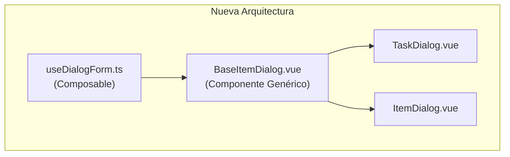

# Plan de Refactorización: TaskDialog.vue e ItemDialog.vue

## Análisis de Código Repetido

### Template (≈90% idéntico)

| Sección            | TaskDialog                                                                  | ItemDialog                                         | Diferencia  |
| ------------------ | --------------------------------------------------------------------------- | -------------------------------------------------- | ----------- |
| MyDialog           | `:visible`, `persistent`, `:pulse`, `:close-on-escape`                      | Mismos props                                       | Ninguna     |
| Header             | Icono `mdi-clipboard-check-outline`, título "New/Edit Task"                 | Icono `mdi-clipboard-text`, título "New/Edit Item" | Solo texto  |
| DialogTabs         | `v-model="viewMode"`                                                        | Mismo                                              | Ninguna     |
| Campos form        | `v-model="title"`, `assignedUser`, `state`, `effort`, `priority`, `project` | `v-model="newItem.title"`, mismos campos           | Form ref    |
| CommentSection     | `associated-type="task"`                                                    | `associated-type="item"`                           | Tipo        |
| AttachmentsSection | Misma estructura                                                            | Misma estructura                                   | Ninguna     |
| HistorySection     | Misma estructura                                                            | Misma estructura                                   | Ninguna     |
| Footer             | Botones Cancel/Save                                                         | Botones Cancel/Save                                | Texto botón |
| MyAlertDialog      | Idéntico                                                                    | Idéntico                                           | Ninguna     |

### Script (≈70% repetido)

**Imports compartidos:**

```typescript
import AttachmentsSection from "@/components/dialogs/AttachmentsSection.vue";
import DialogTabs from "@/components/dialogs/DialogTabs.vue";
import HistorySection from "@/components/dialogs/HistorySection.vue";
import MyAlertDialog from "@/components/my-elements/MyAlertDialog.vue";
import { useAttachments } from "@/composables/useAttachments";
import { useClipboard } from "@/composables/useClipboard";
import { useProjectName } from "@/composables/useProjectName";
import { PRIORITY_OPTIONS, PRIORITY_VALUES } from "@/constants/priorities";
import { STATE_OPTIONS, STATE_VALUES } from "@/constants/states";
import { SPRINT_TEAM_MEMBERS } from "@/constants/users";
import { notifyError } from "@/plugins/my-notification-helper/my-notification-helper";
import { addChange, getChangesByAssociatedId, getUserByUsername, getUsernameById } from "@/services/firestore";
import { useAuthStore } from "@/stores/auth";
import type { ChangeHistory, Item, Task } from "@/types";
```

**Refs reactivas compartidas:**

- `showCloseConfirmation`
- `titleInputRef`
- `isWritingComment`, `isEditingComment`, `hasPendingComment`
- `assignedUserOptions`
- `viewMode`
- `changeHistory`
- `priorityOptions`, `stateOptions`
- `original*` (originalTitle, originalDetail, etc.)

**Métodos compartidos:**
| Método | Repeticiones |
|--------|-------------|
| `loadAssignedUserOptions` | 2 |
| `loadChangeHistory` | 2 |
| `saveChanges` | 2 (cambia solo "task" ↔ "item") |
| `onAssignedUserChange` | 2 |
| `onPriorityChange` | 2 |
| `onStateChange` | 2 |
| `handleSave` | 2 (lógica idéntica) |
| `handleClose` | 2 |
| `handleConfirmClose` | 2 |
| `handleCancelClose` | 2 |
| `onWritingComment` | 2 |
| `onEditingComment` | 2 |
| `resetPendingChanges` | 2 |
| `handleCopyToClipboard` | 2 |
| `onPaste` | 2 (cambia tipo) |
| `onFileSelect`, `onDragDrop`, `onRemoveAttachment` | 2 |

**Watchers compartidos:**

- Watcher para cargar attachments cuando cambia el ID

---

## Arquitectura Propuesta



### 1. Crear `useDialogForm.ts` (Composable)

Manejará la lógica compartida entre Task e Item:

```typescript
// Props genéricas
interface DialogFormOptions<T> {
    type: "task" | "item";
    existingItem?: T | null;
    visible: boolean;
    defaultProjectName?: string;
}

// Estado reactivity
(-showCloseConfirmation - title,
    detail,
    priority,
    state,
    estimatedEffort,
    actualEffort,
    assignedUser,
    projectName - original * fields - assignedUserOptions - priorityOptions,
    stateOptions - viewMode,
    changeHistory -
        // Métodos
        loadAssignedUserOptions() -
        loadChangeHistory(id) -
        saveChanges(oldItem, newItem) -
        onAssignedUserChange(options) -
        onPriorityChange(options) -
        onStateChange(options) -
        resetForm() -
        buildItemFromForm() -
        handleClose() -
        handleSave() -
        // Computed
        canSave -
        hasChanges -
        hasPendingChanges -
        shouldShowCloseConfirmation);
```

### 2. Crear `BaseItemDialog.vue` (Componente Genérico)

Template base con slots para personalización:

```vue
<template>
    <MyDialog :visible="visible" ...>
        <!-- Header con slot para título e icono -->
        <slot name="header">
            <h3>{{ title }}</h3>
        </slot>

        <!-- Tabs -->
        <DialogTabs v-if="isEditing" v-model="viewMode" :show-tabs="isEditing" />

        <!-- Vista details con slots para campos -->
        <slot name="details" />

        <!-- Attachments -->
        <AttachmentsSection ... />

        <!-- History -->
        <HistorySection ... />

        <!-- Footer con slots para botones -->
        <slot name="footer" />

        <!-- Alert Dialog -->
        <MyAlertDialog ... />
    </MyDialog>
</template>
```

### 3. Refactorizar TaskDialog.vue

```vue
<template>
    <BaseItemDialog v-bind="dialogProps">
        <template #header>
            <v-icon class="yellow" size="30">mdi-clipboard-check-outline</v-icon>
            {{ isEditing ? "Edit Task" : "New Task" }}
        </template>

        <template #details>
            <!-- Campos específicos de Task -->
        </template>

        <template #footer>
            <MyButton secondary @click="handleClose">Cancel</MyButton>
            <MyButton @click="handleSave">{{ isEditing ? "Save Changes" : "Add Task" }}</MyButton>
        </template>
    </BaseItemDialog>
</template>
```

### 4. Refactorizar ItemDialog.vue

Similar a TaskDialog, pero usando el mismo componente base.

---

## Pasos de Implementación

### Fase 1: Crear Composable

- [ ] Crear `src/composables/useDialogForm.ts`
- [ ] Definir interfaces genéricas para tipos
- [ ] Mover lógica compartida (≈300 líneas)
- [ ] Exponer estado y métodos necesarios

### Fase 2: Crear Componente Base

- [ ] Crear `src/components/dialogs/BaseItemDialog.vue`
- [ ] Extraer template repetido
- [ ] Agregar slots para personalización
- [ ] Usar composable internamente

### Fase 3: Refactorizar TaskDialog

- [ ] Reescribir usando BaseItemDialog
- [ ] Usar composable useDialogForm
- [ ] Eliminar código duplicado (~400 líneas)

### Fase 4: Refactorizar ItemDialog

- [ ] Reescribir usando BaseItemDialog
- [ ] Usar composable useDialogForm
- [ ] Eliminar código duplicado (~400 líneas)

### Fase 5: Testing

- [ ] Verificar funcionamiento de TaskDialog
- [ ] Verificar funcionamiento de ItemDialog
- [ ] Probar flujos: crear, editar, cerrar con cambios pendientes

---

## Beneficios Esperados

| Métrica           | Antes   | Después                     |
| ----------------- | ------- | --------------------------- |
| Líneas duplicadas | ~800    | ~100                        |
| Componentes       | 2       | 3 (1 base + 2 hijos)        |
| Mantenibilidad    | Difícil | Fácil                       |
| Bugs potenciales  | Mayor   | Menor (lógica centralizada) |

---

## Consideraciones

1. **ItemDialog tiene lógica adicional:**
    - `itemHasTasks` - deshabilitar campos cuando hay tareas
    - Objeto `newItem` vs campos individuales
    - `nextOrder` prop

2. **Diferencias en handleClose:**
    - TaskDialog usa `clearQueryParams()`
    - ItemDialog no lo usa

3. **Diferencias en resetForm:**
    - TaskDialog: `resetFormForEditing` y `resetFormForNew`
    - ItemDialog: lógica inline

4. **Seguridad de tipos:**
    - Usar generics para mantener tipado fuerte
    - Evitar `any`
