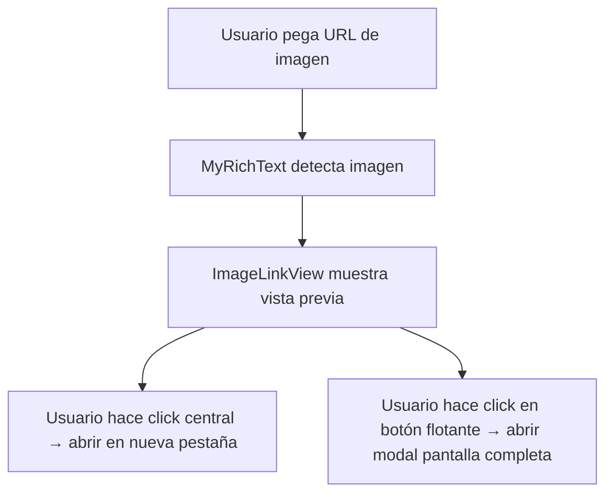

# Plan: Vista Previa de Imágenes en Descripciones y Comentarios

## Objetivo

Reemplazar los enlaces de imágenes por vistas previas thumbnails, con las siguientes funcionalidades:

- Click del reel del mouse (botón central) abre la imagen en nueva pestaña
- Botón flotante (arriba a la derecha) para ver imagen en pantalla completa

## Análisis del Código Actual

### Componentes Relevantes

1. **ImageLinkView.vue** (`src/components/ImageLinkView.vue:1-32`)
    - Actualmente muestra solo un enlace de texto `<a href="...">`
    - Usado por la extensión TipTap `ImageLink` en `MyRichText`

2. **CommentSection.vue** (`src/components/global/CommentSection.vue:143-150`)
    - Función `processCommentHtml` convierte `` en enlaces de texto
    - Esto afecta las descripciones en comentarios

3. **MyRichText.vue** (`src/components/global/MyRichText.vue:28-83`)
    - Editor TipTap que usa la extensión `ImageLink`
    - Se usa para descripciones de items y comentarios

## Plan de Implementación

### Tareas a Realizar

1. **Crear componente reutilizable `ImagePreview.vue`**
    - Mostrar thumbnail de la imagen (mínimo 200x200px, máximo 800x800px)
    - La imagen se ajusta según su proporción original (object-fit: contain)
    - Hover para mostrar opciones
    - Click central (botón del mouse) → abrir en nueva pestaña (`window.open`)
    - Botón flotante arriba a la derecha → abrir diálogo de pantalla completa

2. **Modificar `ImageLinkView.vue`**
    - Reemplazar enlace de texto por `ImagePreview`
    - Integrar con TipTap NodeView

3. **Modificar `CommentSection.vue`**
    - Actualizar `processCommentHtml` para convertir URLs de imágenes en componentes renderizables
    - Alternativa: crear un componente similar a ImageLinkView para comentarios

4. **Crear `FullScreenImageDialog.vue`**
    - Modal de pantalla completa
    - Botón de cerrar
    - Imagen con max-width/height para responsividad

## Archivos a Modificar/Crear

| Archivo                                    | Acción                                |
| ------------------------------------------ | ------------------------------------- |
| `src/components/ImagePreview.vue`          | **CREAR** - Componente reutilizable   |
| `src/components/FullScreenImageDialog.vue` | **CREAR** - Modal pantalla completa   |
| `src/components/ImageLinkView.vue`         | **MODIFICAR** - Usar ImagePreview     |
| `src/components/global/CommentSection.vue` | **MODIFICAR** - Renderizar miniaturas |
| `src/changelog.md`                         | **MODIFICAR** - Documentar cambios    |
